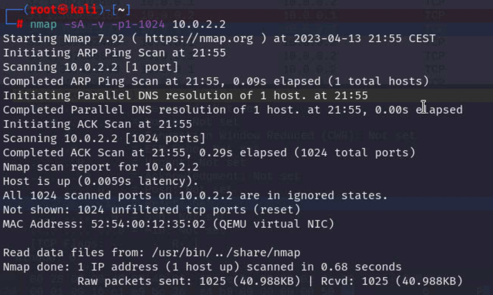
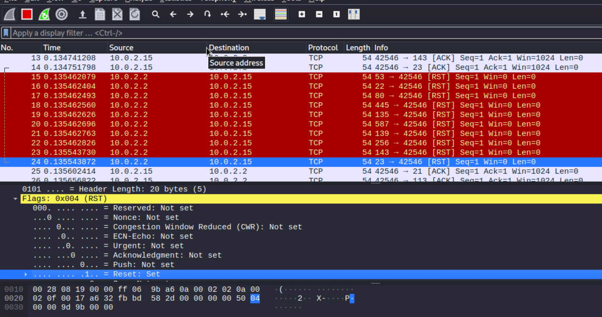
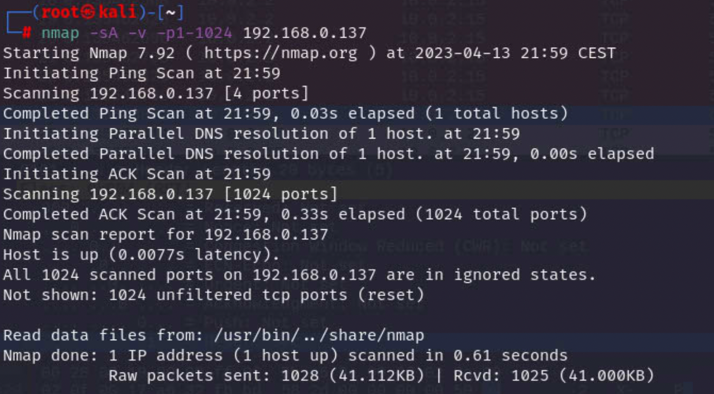
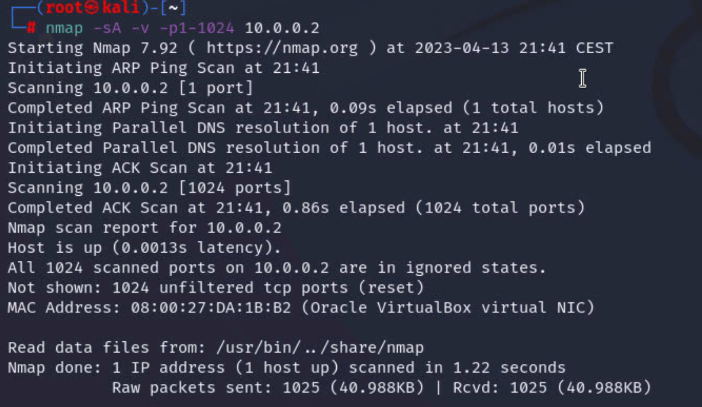
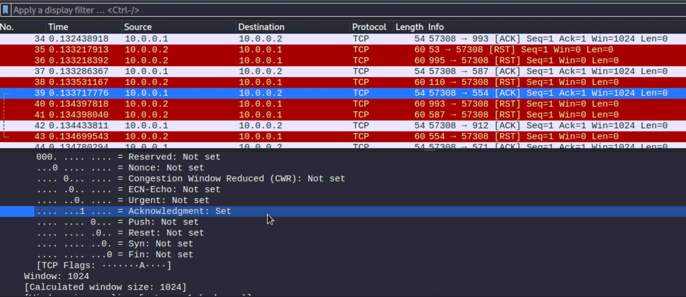
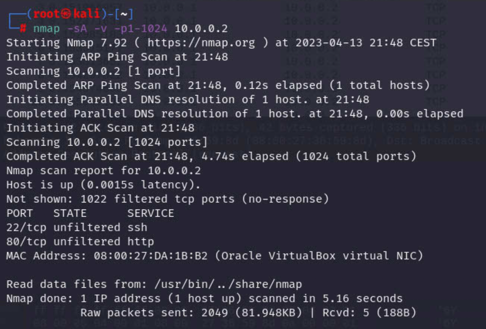
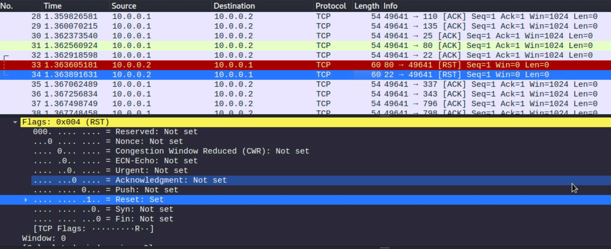

# TCP ACK port scanning

### 1.TCP ACK host virtual interface 10.0.2.2

### 2.TCP ACK host physical interface 192.168.0.137

### 3.TCP ACK scanning-target without firewall

### 4.TCP ACK scanning-target with firewall

port 22 and 80 response with [RST]