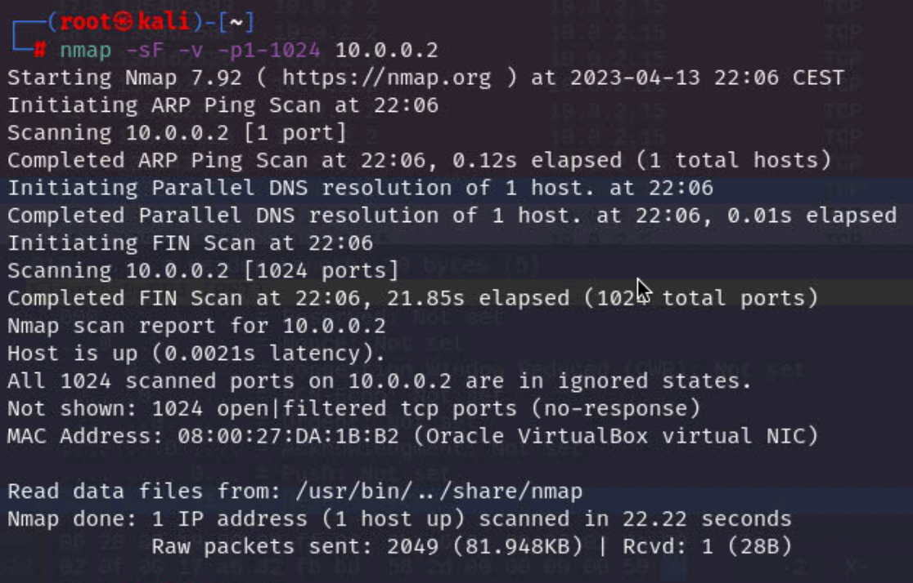

# TCP FIN port scanning

### 1.TCP FIN host virtual interface 10.0.2.2

### 2.TCP FIN host physical interface 192.168.0.137

### send 3 ICMP packages in the beginning not ARP

### Response - [RST, ACK]

### 3.TCP FIN scanning-target without firewall

### Response(1) - [RST,ACK]

### Response(2) - no response

### 4.TCP FIN scanning-target with firewall

### Request

