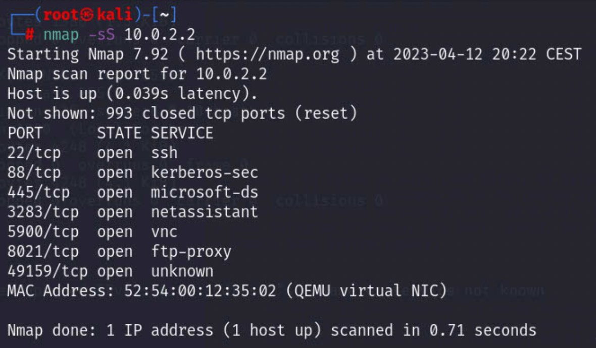
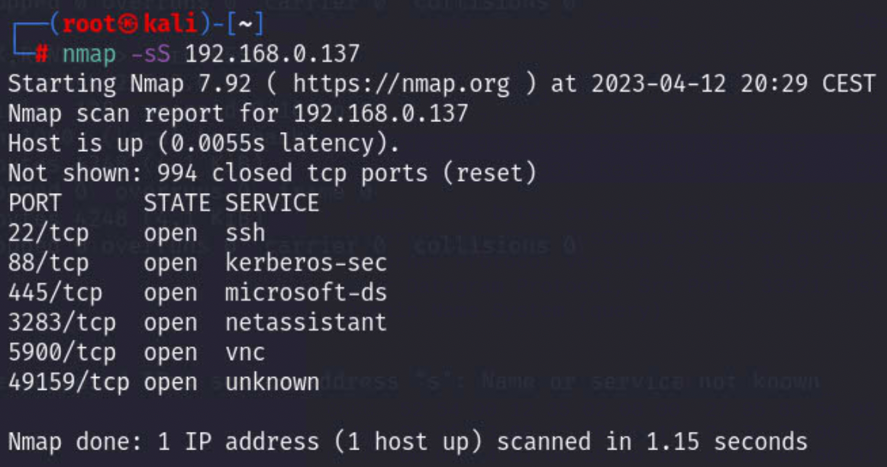
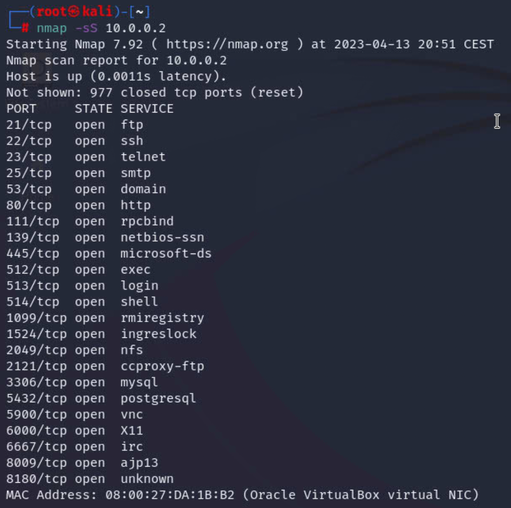
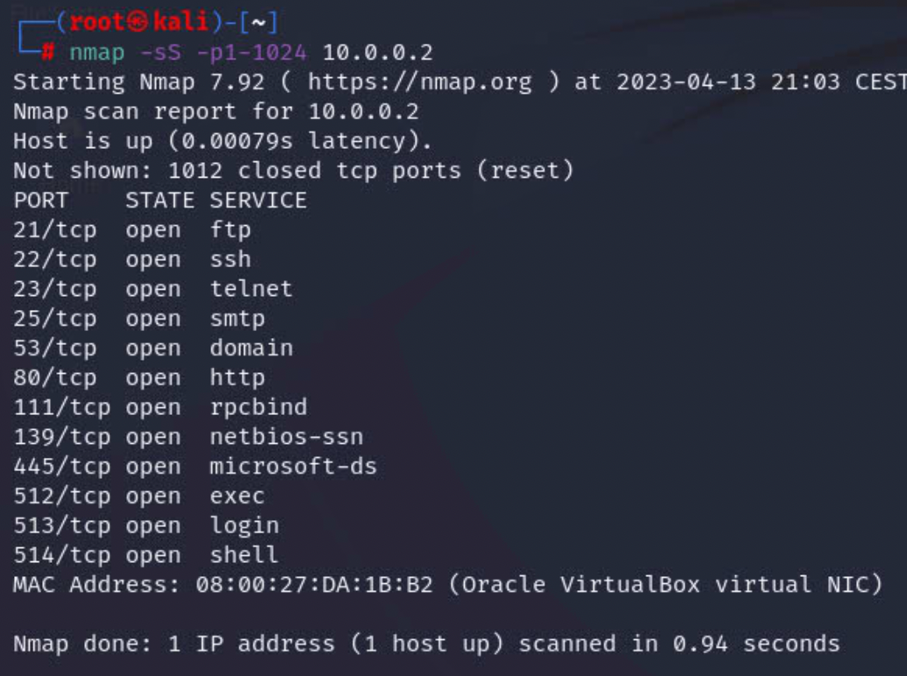
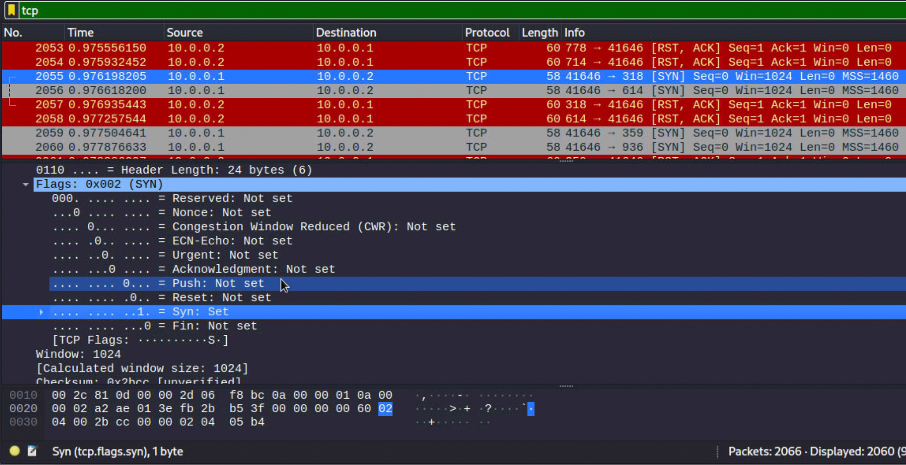
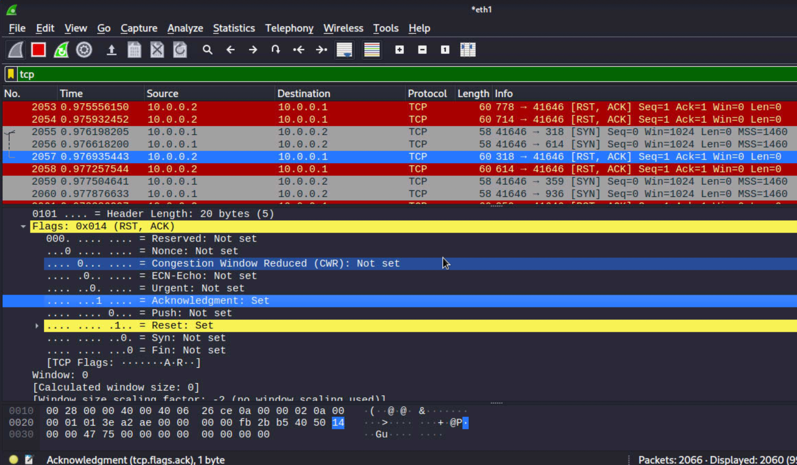
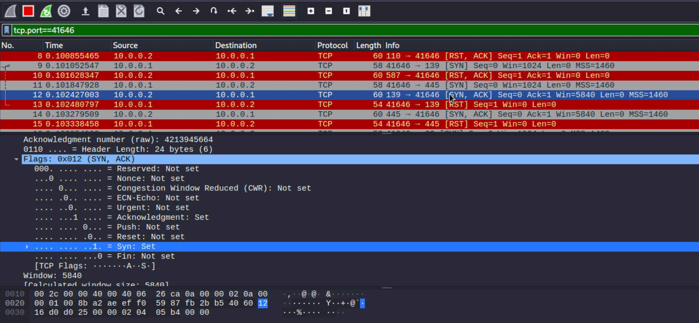
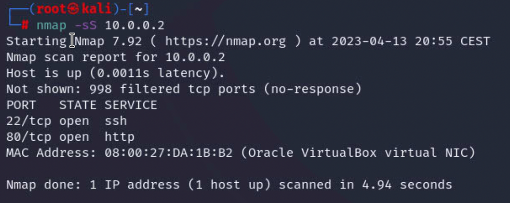
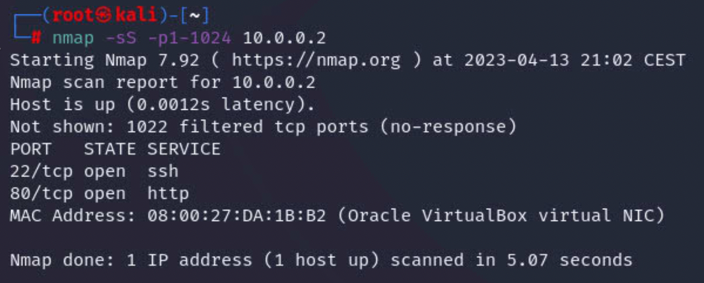

# TCP SYN port scanning

### 1 TCP SYN host virtual interface 10.0.2.2

### 2 TCP SYN host physical interface 192.168.0.137

### 3 TCP SYN scanning-target without firewall

****

### request

### Response(1)

This is very simply that **the port you are trying to connect to is not being listened to on the remote host**. Either your service is not running on the host, or possibly it has been firewalled.

### Response(2)

some response with [SYN,ACK], which means the port is open.

### 4 TCP SYN scanning-target with firewall

