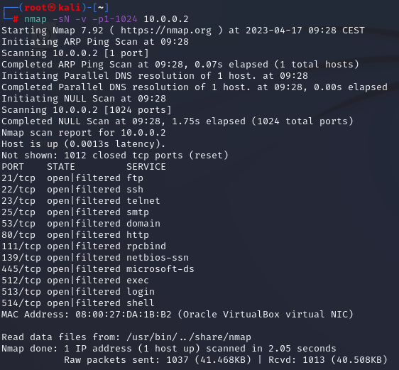
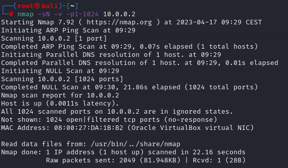
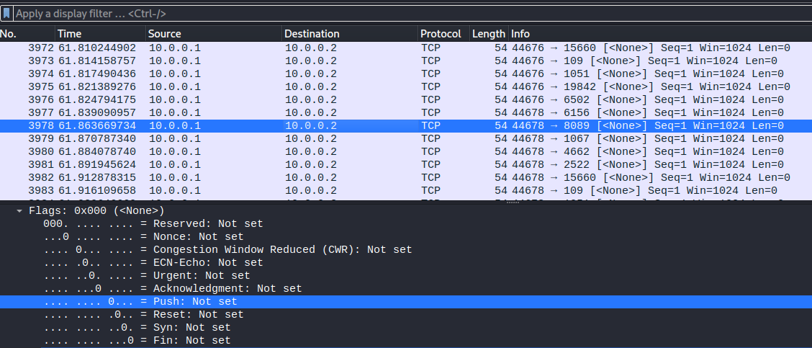
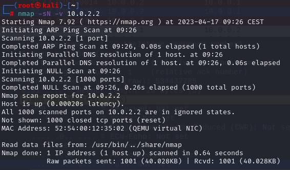
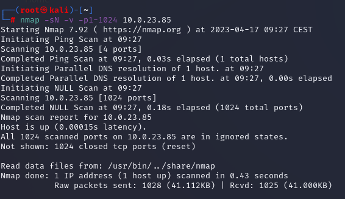

# Null scan

### 1. TCP Null scanning-target without firewall

​	

### 2. TCP Null scanning-target with firewall

### 3. TCP Null host virtual interface 10.0.2.2

### 4. TCP Null host physical interface 10.0.23.85

