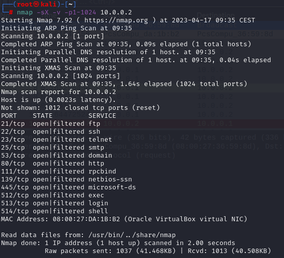
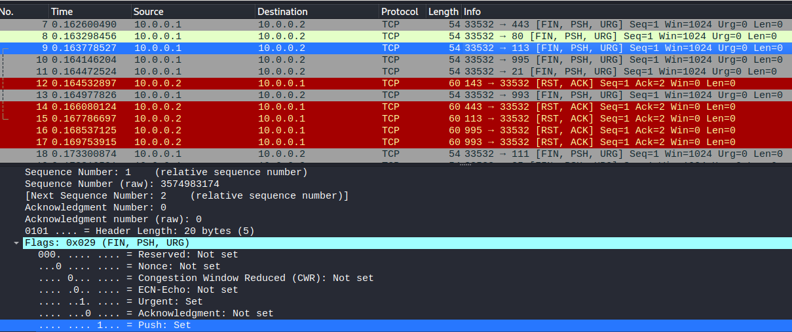
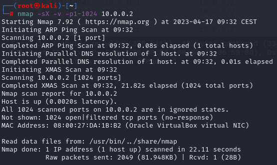
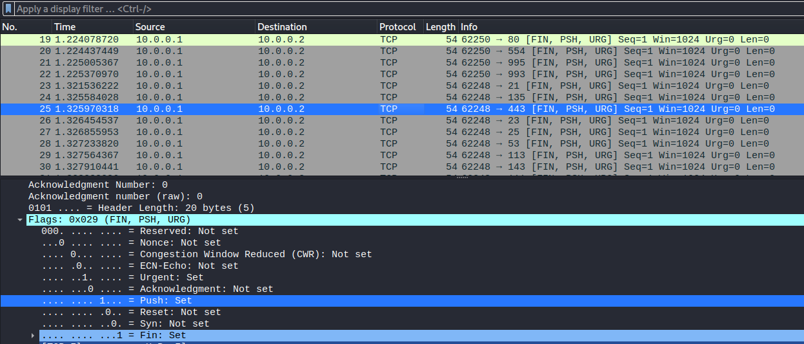
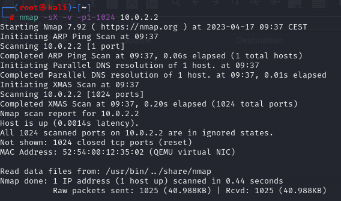
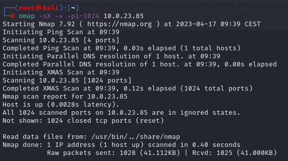
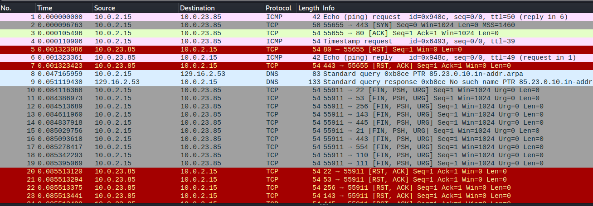

# Xmas scans

### 1.TCP Xmas scanning-target without firewall

### 2. TCP Xmas scanning-target with firewall

### 3. TCP Xmas host virtual interface 10.0.2.2

### 4. TCP Xmas host physical interface 10.0.23.85

