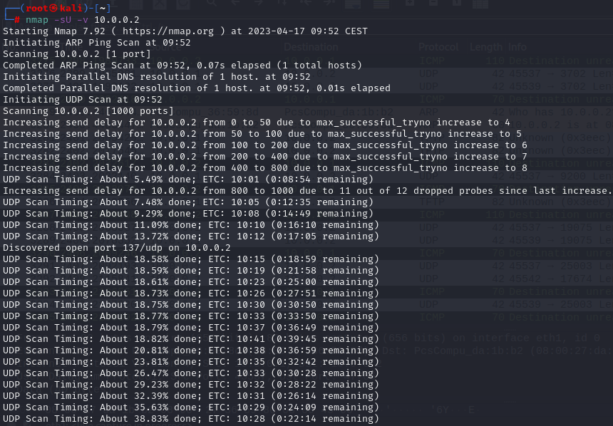
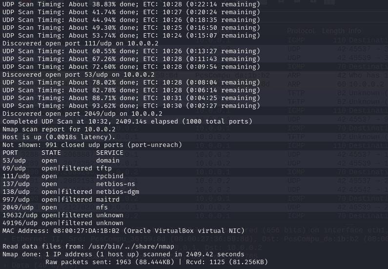
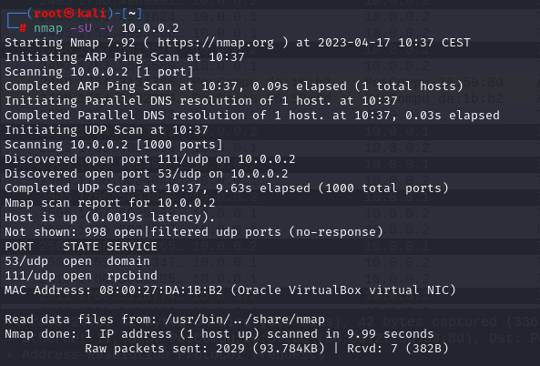
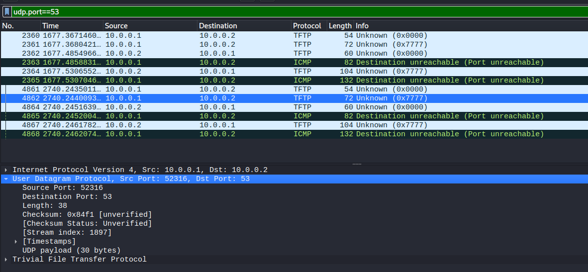
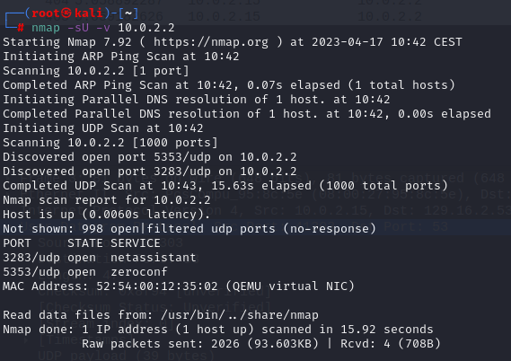
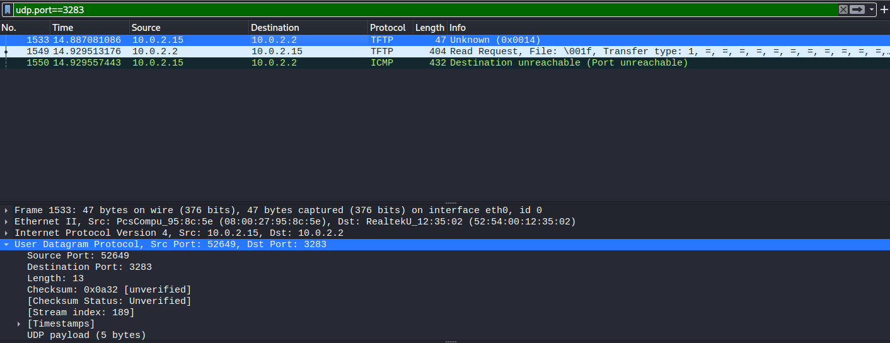
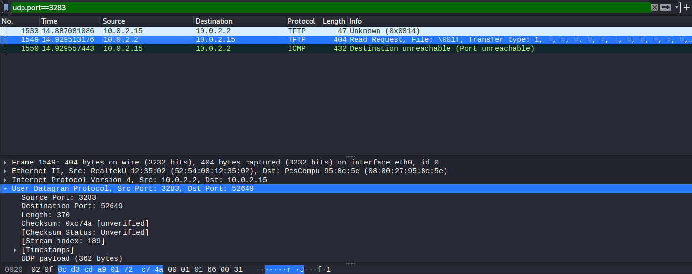
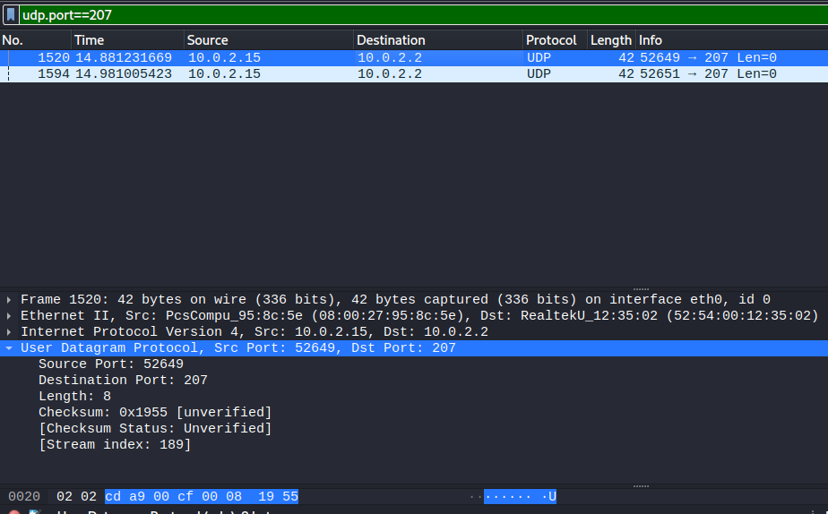
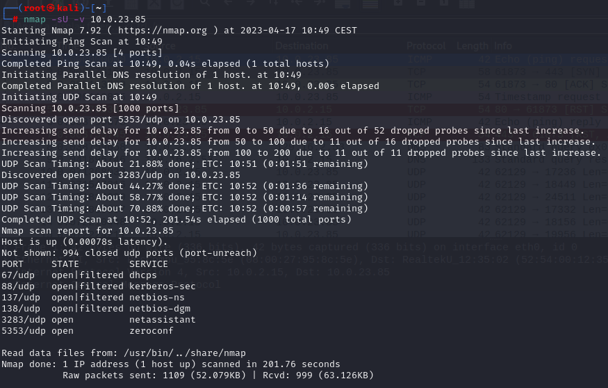

# UDP port scan

### 1.UDP scanning-target without firewall

### 2.UDP scanning-target with firewall

### 3.UDP host virtual interface 10.0.2.2

### 4.UDP host physical interface 10.0.23.85

