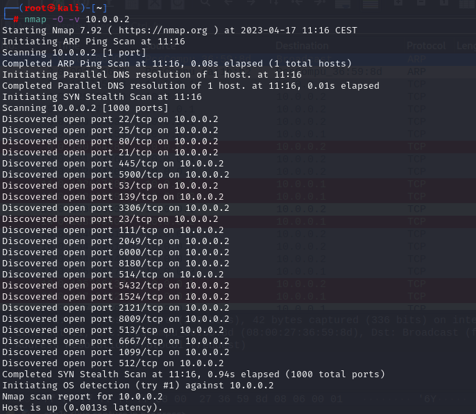
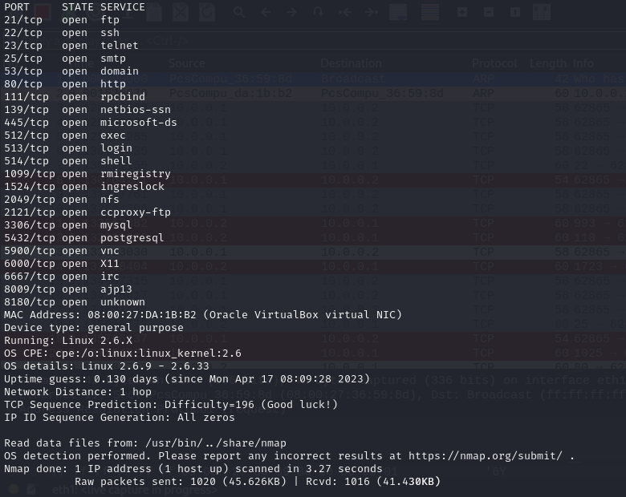
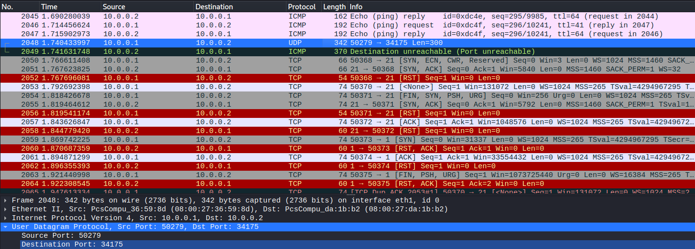
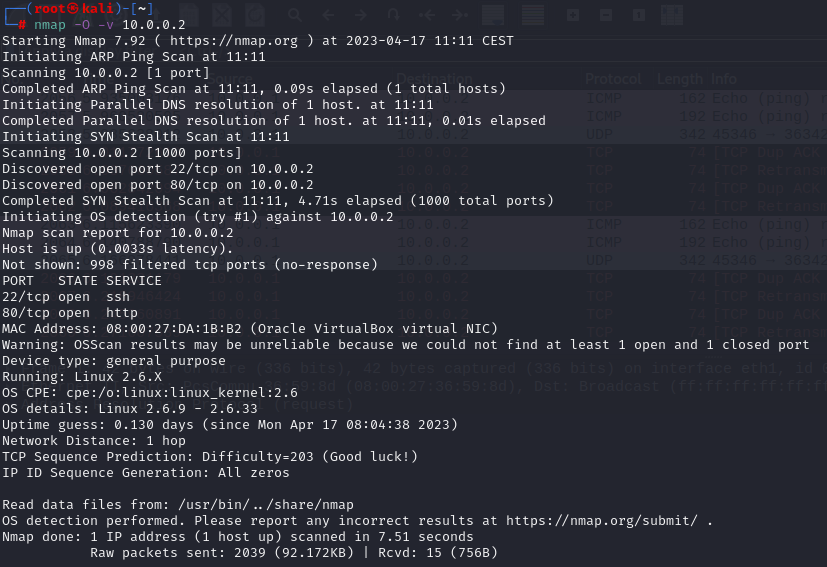
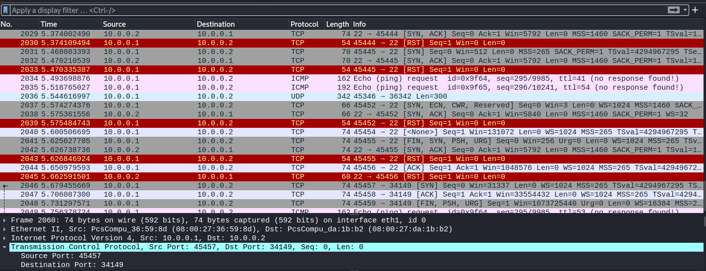
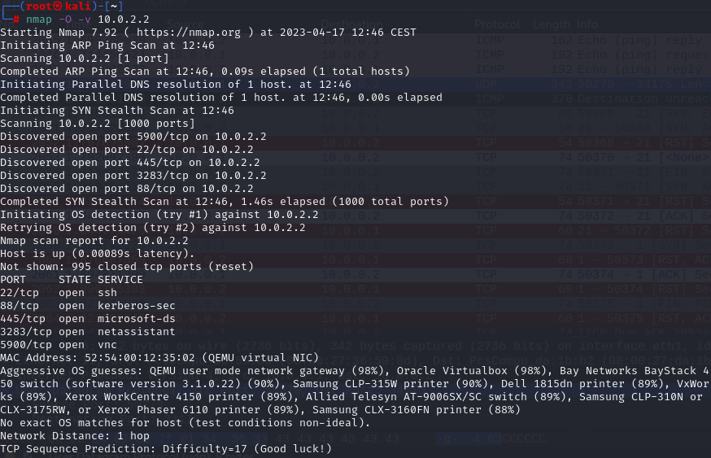
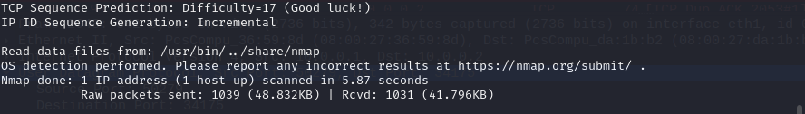
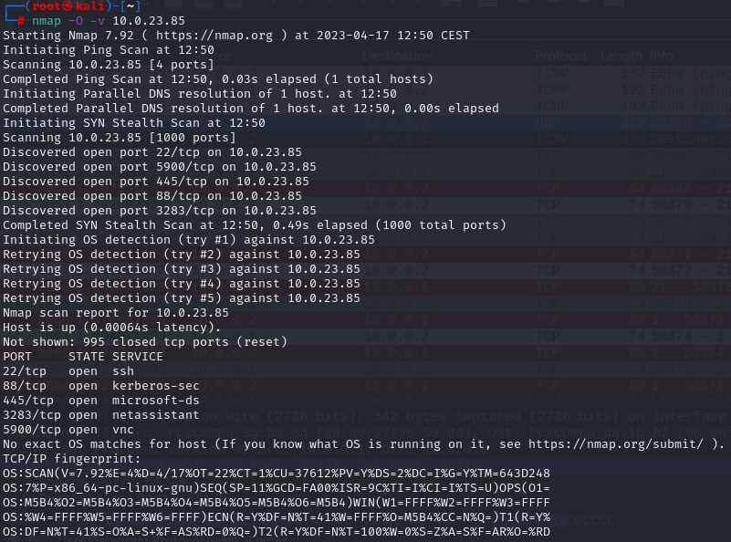
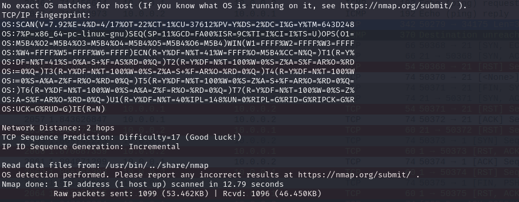

# TCP fingerprinting

### 1.TCP fingerprinting scanning-target without firewall

### 2.TCP fingerprinting scanning-target with firewall

### 3.TCP fingerprinting host virtual interface 10.0.2.2

### 4. TCP fingerprinting host physical interface 10.0.23.85

