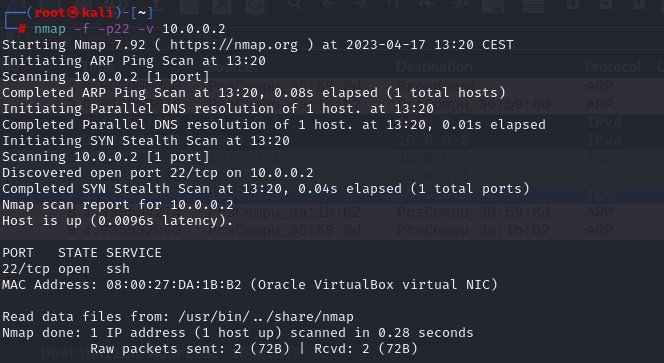
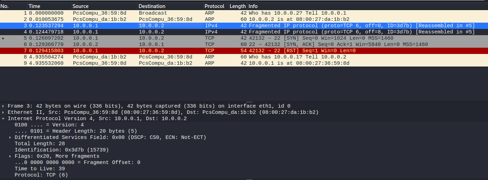
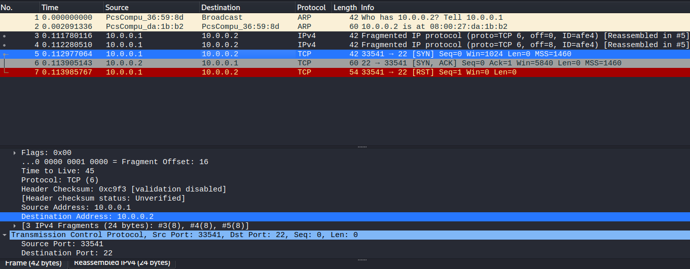
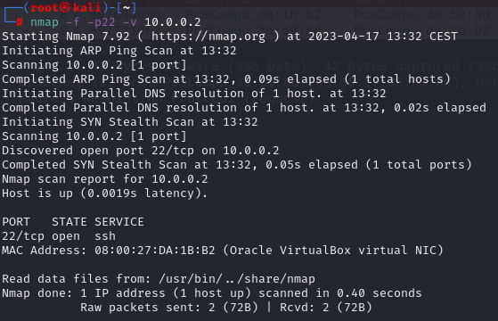
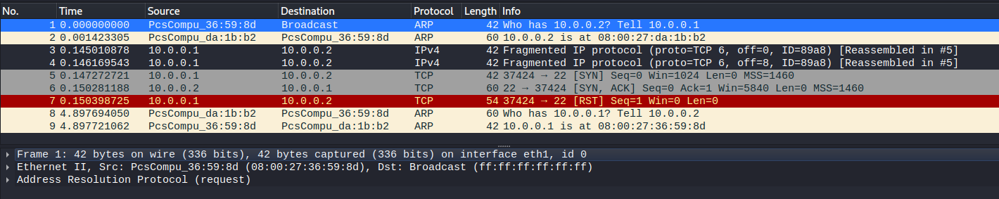
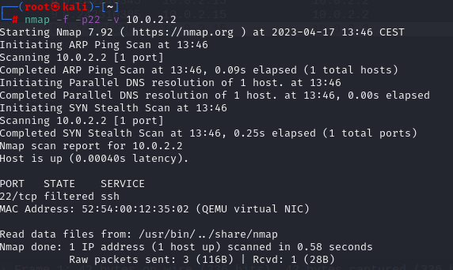
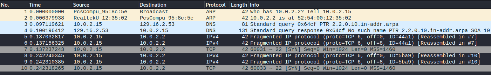
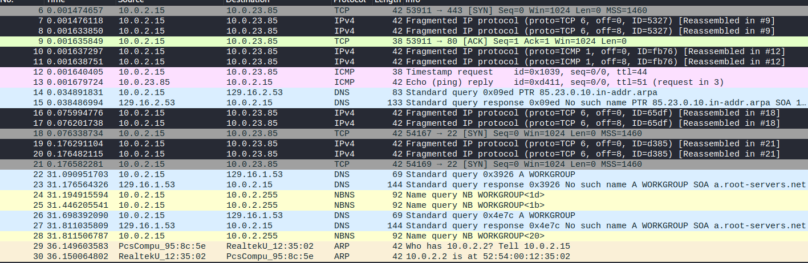

# Fragmentation

### 1.Fragmentation scanning-target without firewall

### 2.Fragmentation scanning-target with firewall

### 3.Fragmentation host virtual interface 10.0.2.2

### 4.Fragmentation host physical interface 10.0.23.85

