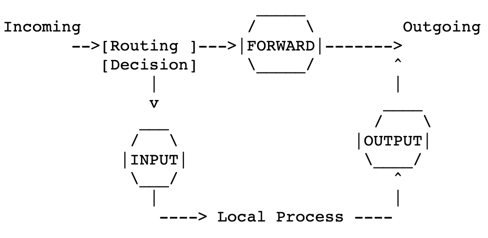

There are three predefined chains of rules (in the filter table), INPUT, FORWARD, and OUTPUT.

### Q1: How and when is each chain used?

The three circles represent the three chains mentioned above. When a packet reaches a circle in the diagram, that chain is examined to decide the fate of the packet. If the chain says to DROP the packet, it is killed there, but if the chain says to ACCEPT the packet, it continues traversing the diagram.

**1. INPUT:** This chain is used for all incoming traffic destined for the local system. 

**2. FORWARD**: This chain is used for all traffic that is not destined for the local system but is being forwarded to another system. 

**3. OUTPUT:** This chain is used for all outgoing traffic originating from the local system.

A chain is a checklist of **rules**.

- Each rule says `if the packet header looks like this, then here's what to do with the packet'. 
- If the rule doesn't match the packet, then the next rule in the chain is consulted.
-  If there are no more rules to consult, then the kernel looks at the chain **policy** to decide what to do. In a security-conscious system, this policy usually tells the kernel to DROP the packet.