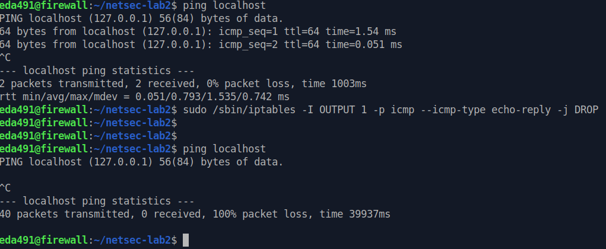
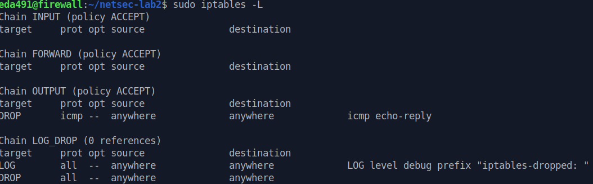
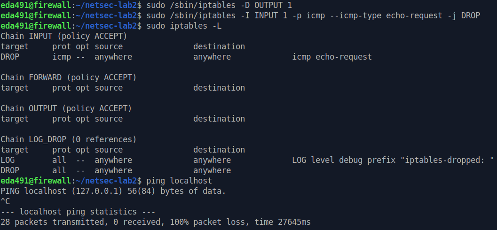

#### $ sudo /sbin/iptables -I OUTPUT 1 -p icmp --icmp-type echo-reply -j DROP

The command add a new rule to the beginning of the OUTPUT chain in the iptables firewall configuration. The rule will drop any outgoing ICMP echo-reply packets.

- `sudo`: This command runs the iptables command with root privileges.

- `/sbin/iptables`: This is the iptables command that is used to configure the firewall.

- `-I OUTPUT 1`: This option inserts a new rule at the beginning (i.e., position 1) of the OUTPUT chain.

- `-p icmp`: This option specifies that the rule applies to the ICMP protocol.

- `--icmp-type echo-reply`: This option specifies that the rule applies to the echo-reply message type, which is sent in response to an ICMP echo (ping) request.

- `-j DROP`: This option specifies that any matching packets should be dropped (i.e., blocked) and not allowed to pass through the firewall.

### Q2: What is the effect of dropping echo-reply packets in the OUTPUT chain? Use Figure 2a to illustrate the path of the packets. Mark the path with arrows and use an X to mark the point where the packets are dropped.

Dropping ICMP echo-reply packets in the **OUTPUT chain** will **prevent the local system from sending any responses to ICMP echo (ping) requests that are received from the network.**

### Q3: What is the effect of dropping echo-request packets in the INPUT chain? Use Figure 2b to illustrate the path of the packets. Mark the path with arrows and use an X to mark the point where the packets are dropped. From a security point of view, is this better or worse than dropping echo-replies in the OUTPUT chain? What about performance?

Dropping ICMP echo-request packets in the **INPUT chain** will **prevent the local system from receiving any ICMP echo (ping) requests that are sent from the network.** 

From a security point of view, dropping ICMP echo-request packets in the INPUT chain is generally a better practice than dropping ICMP echo-reply packets in the OUTPUT chain. 

This is because blocking incoming packets in the INPUT chain prevents them from being processed by the local system's network stack, which can potentially **reduce the load on the system's CPU and network resources.** 

### 
