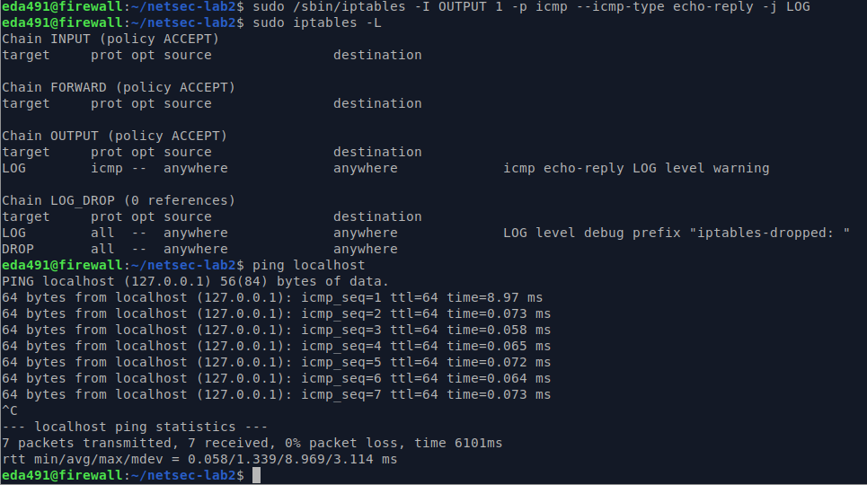
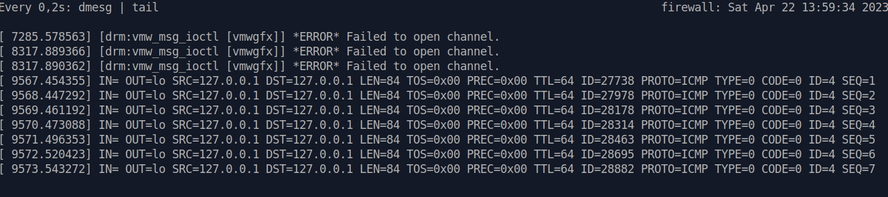

```shell
sudo /sbin/iptables -I OUTPUT 1 -p icmp --icmp-type echo-reply -j LOG
```



```shell
watch -n 0,2 'dmesg | tail'
```



### Q4: What do the log items IN, OUT, SRC, DST and PROTO mean and why might they be useful?


**IN:** Indicates the direction of the traffic. A value of "IN" indicates incoming traffic, while a value of "OUT" indicates outgoing traffic.

**OUT:** Indicates the direction of the traffic. A value of "OUT" indicates outgoing traffic, while a value of "IN" indicates incoming traffic.

**SRC:** Indicates the source IP address or hostname of the traffic.

**DST:** Indicates the destination IP address or hostname of the traffic.

**PROTO:** Indicates the protocol used by the traffic.

#### These log items can be useful for a variety of purposes, such as:

**Troubleshooting network connectivity issues:** By examining the IN and OUT values, you can determine whether the local system is receiving incoming traffic or sending outgoing traffic, which can help to diagnose connectivity problems.

**Analyzing network traffic patterns:** By examining the SRC and DST values, you can determine the origin and destination of network traffic, which can help to identify patterns and potential security threats.

**Monitoring network usage:** By examining the PROTO value, you can determine which protocols are being used on the network and how much traffic they are generating, which can help to monitor and manage network usage.