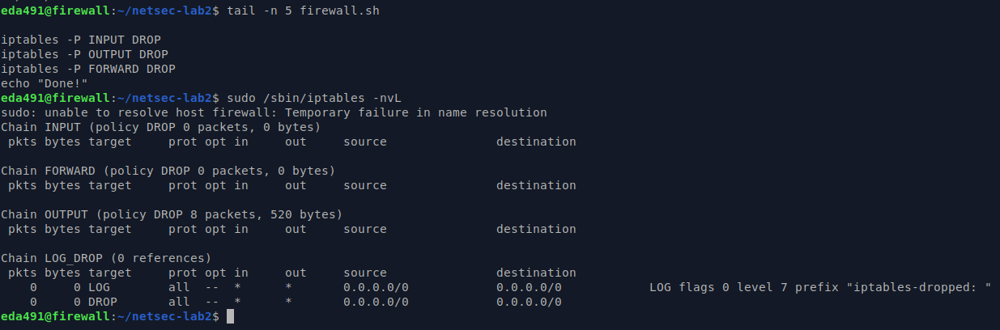

### 7.3.1 Common firewall rules

#### 1. Set the default policies to default deny (Requirement #1).

#### Q6: Consider a firewall which uses a default permit policy, and has no other rules set. Is the system secure? Is it useful?

A firewall with **a default permit policy**, and no other rules set, is **not secure**.

all traffic is allowed through the firewall, including potentially malicious traffic such as viruses, malware, and unauthorized access attempts. An attacker can exploit this vulnerability by sending traffic to the system, potentially gaining unauthorized access to sensitive data, services or applications.

#### Q7: Consider the reverse: a firewall which uses a default deny policy, and has no other rules set. Is the system secure? Is it useful?

It is secure, all traffic is blocked by default.

This approach minimizes the risk of unauthorized access or malware infections.

However, it maybe not useful, as all traffic will be blocked by default, including legitimate traffic necessary for the system.

#### 2. Allow all traffic from the loopback device (Requirement #2).