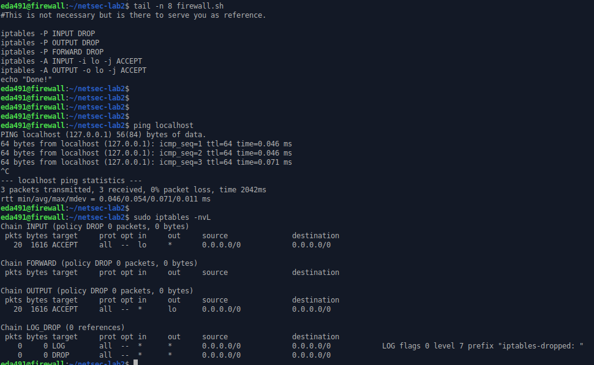
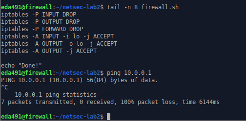

### 7.3.1 Common firewall rules

#### 1. Set the default policies to default deny (Requirement #1).

```shell
iptables -P INPUT DROP
iptables -P FORWARD DROP
iptables -P OUTPUT DROP
```


#### Q6: Consider a firewall which uses a default permit policy, and has no other rules set. Is the system secure? Is it useful?

A firewall with **a default permit policy**, and no other rules set, is **not secure**.

all traffic is allowed through the firewall, including potentially malicious traffic such as viruses, malware, and unauthorized access attempts. An attacker can exploit this vulnerability by sending traffic to the system, potentially gaining unauthorized access to sensitive data, services or applications.

#### Q7: Consider the reverse: a firewall which uses a default deny policy, and has no other rules set. Is the system secure? Is it useful?

It is secure, all traffic is blocked by default.

This approach minimizes the risk of unauthorized access or malware infections.

However, it maybe not useful, as all traffic will be blocked by default, including legitimate traffic necessary for the system.

#### 2. Allow all traffic from the loopback device (Requirement #2).

```shell
iptables -A INPUT -i lo -j ACCEPT
iptables -A OUTPUT -o lo -j ACCEPT
```



#### 3. Allow traffic from your host (Requirement #3).

```shell
iptables -A OUTPUT -j ACCEPT
```

​	

#### 4. Drop spoofed packets (Requirement #4).

```shell
sudo ipset create allowed_ips hash:net
sudo ipset add allowed_ips 10.0.0.0/24

sudo ipset create prohibited_ips hash:net
sudo ipset add prohibited_ips 10.0.0.0/8
sudo ipset add prohibited_ips 172.16.0.0/12
sudo ipset add prohibited_ips 192.168.0.0/16
sudo ipset add prohibited_ips 169.254.0.0/16
```

```shell
# blocking incoming unwanted packets
iptables -A INPUT -i enp0s3 -m set --match-set prohibited_ips src -m set ! --match-set allowed_ips src -j LOG --log-prefix "spoofed packets: "
iptables -A INPUT -i enp0s3 -m set --match-set prohibited_ips src -m set ! --match-set allowed_ips src -j DROP

# blocking outcoming unwanted packets
iptables -A OUTPUT -o enp0s3 -m set --match-set prohibited_ips dst -m set ! --match-set allowed_ips dst -j LOG --log-prefix "spoofed packets: "
iptables -A OUTPUT -o enp0s3 -m set --match-set prohibited_ips dst -m set ! --match-set allowed_ips dst -j DROP
```


#### 5. Allow established connections (stateful inspection) (Requirement #5).

```shell
iptables -A INPUT -m state --state RELATED,ESTABLISHED -j ACCEPT
iptables -A OUTPUT -m state --state RELATED,ESTABLISHED -j ACCEPT
```


#### Q8: How can you check if your rule(s) for established connections is (are) working?


#### 6. Allow ping and add protection from ping-flooding (Requirement #6).


#### Q9: How can you check if your rule(s) for limiting echo-request packets to 1 per second is (are) working? Give two examples!


#### 7. Drop Xmas and Null packets (Requirement #7).