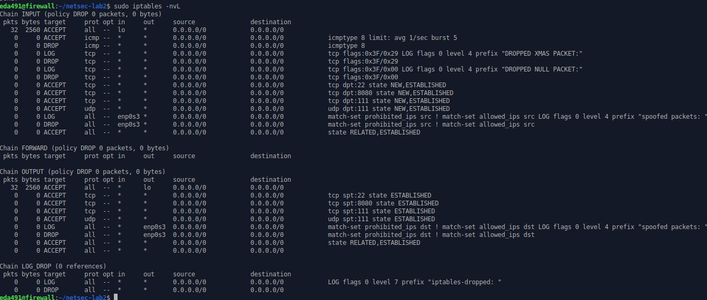

#### 8. Allow specific applications (Requirement #8).

```shell
# Allow incoming traffic, ssh and http only use tcp, portmapper could use tcp or udp
iptables -A INPUT -p tcp --dport 22 -m state --state NEW,ESTABLISHED -j ACCEPT
iptables -A INPUT -p tcp --dport 8080 -m state --state NEW,ESTABLISHED -j ACCEPT
iptables -A INPUT -p tcp --dport 111 -m state --state NEW,ESTABLISHED -j ACCEPT
iptables -A INPUT -p udp --dport 111 -m state --state NEW,ESTABLISHED -j ACCEPT

# Allow outgoing traffic
iptables -A OUTPUT -p tcp --sport 22 -m state --state ESTABLISHED -j ACCEPT
iptables -A OUTPUT -p tcp --sport 8080 -m state --state ESTABLISHED -j ACCEPT
iptables -A OUTPUT -p tcp --sport 111 -m state --state ESTABLISHED -j ACCEPT
iptables -A OUTPUT -p udp --sport 111 -m state --state ESTABLISHED -j ACCEPT
```


