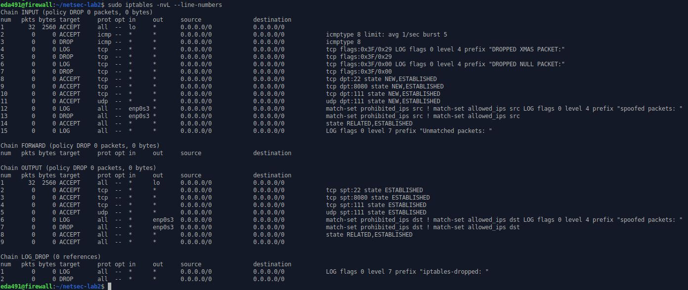
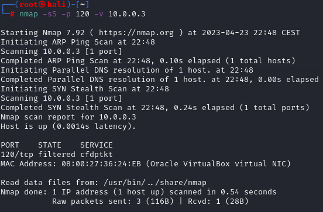
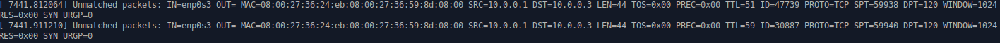

#### 9. Log all other packets (Requirement #9).

````shell
# iptables -A INPUT -m limit --limit 5/min -j LOG --log-prefix "Unmatched packets: " --log-level 7

iptables -A INPUT -j LOG --log-prefix "Unmatched packets: " --log-level 7
iptables -A OUTPUT -j LOG --log-prefix "Unmatched packets: " --log-level 7
````



```shell
# check other ports
sudo nmap -sS -p 120 -v 10.0.0.3
```

​	


