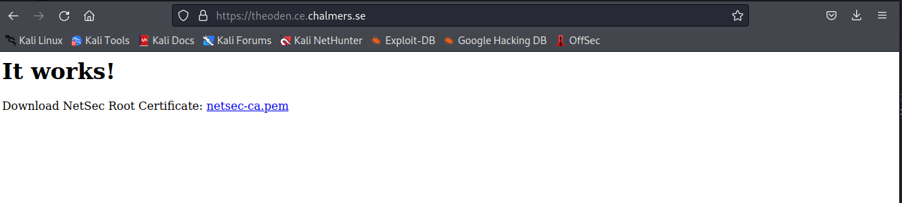

# Part 1: Authentication using certificates

### Q1: What are the possible reasons for this security warning?

**What is intermediate certificate?**

An **intermediate certificate**, also known as an intermediate CA (Certificate Authority), is a type of digital certificate that sits between a root certificate and an end-entity certificate.

In a public key infrastructure (PKI), the root certificate is the top-level certificate that is used to verify the authenticity of a digital certificate. However, root certificates are typically kept offline and are not used for day-to-day operations. Instead, intermediate certificates are used to issue and verify SSL/TLS certificates, which are used to secure web traffic, email communication, and other online interactions.

###### Intermediate certificates are necessary because they allow for a hierarchical trust model, where multiple levels of certificates are used to establish trust and verify the identity of a website or organization. This helps to ensure that sensitive information is protected and that users can trust the websites they are interacting with.

### Q2: Who is the issuer of the certificate? (answer with the Common Name)

Netsec CA

### Q3: To whom is the certificate issued? (answer with the Common Name)

theoden.ce.chalmers.se

### Q4: Why is there no security warning any more? Explain using the following terms: web browser, root certificate, web server certificate, signature, verification.

​	

​	

After I imported the NetSec's certificate into the web browser and add it to the list of trusted certificates, the browser now recognizes that certificate as a trusted root certificate. This means that any web server certificate signed by NetSec CA will also be trusted by the browser.

**Step 1:** the web server sends its own certificate to your browser, which includes a signature from the issuer. This signature is generated using a private key that only the issuer has access to, and can be verified using the public key contained within the root certificate that your browser trusts.

**Step 2: **When your browser receives the web server certificate, it checks the signature using the public key from the trusted root certificate. If the signature matches, your browser can verify that the web server is who it claims to be and that the connection is secure. However, if the web server certificate was not signed by a trusted root certificate, your browser would warn you that the connection may not be secure.

**Note: The difference between the issuer's public key and the subject public key**

In an X.509 certificate, the issuer's public key is typically included in the issuer's own X.509 certificate, which is signed by a higher-level certificate authority (CA). This forms a chain of trust, where the root CA is at the top of the chain, and each subsequent certificate is signed by the one above it.

To verify the validity of an X.509 certificate, your web browser or other software first checks that the certificate has been signed by a trusted root CA. The software then follows the chain of trust by checking that each subsequent certificate in the chain has been signed by the one above it, until it reaches the certificate of the website or server you are connecting to.
