# Part 2: Confidentiality using TLS

You will now investigate how TLS ensures confidentiality by studying the handshake procedure. There is a tool for debugging SSL/TLS connections which has many useful options: s_client, a sub-command of openssl. By using the appropriate options and flags, you will be able to answer the questions.

### Q5: What is the reason the verification failed?

```shell
openssl s_client -connect localhost:443 -tls1_2
```

**Reason: unable to verify the first certificate**

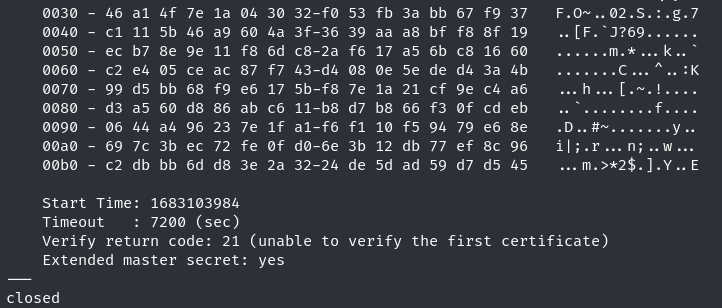

### Q6: Once theoden’s identity is correctly verified, the printout should differ slightly: What did you do, and why did this solve the problem?

```shell
# using the right root certificate to verify the server's certificate
openssl s_client -CAfile /home/eda491/netsec-lab3/cahome/cacert.pem -connect 127.0.0.1:443 -tls1_2

# or use the following command
openssl s_client -CAfile /home/eda491/netsec-lab3/netsec-ca.pem -connect 127.0.0.1:443 -tls1_2
```

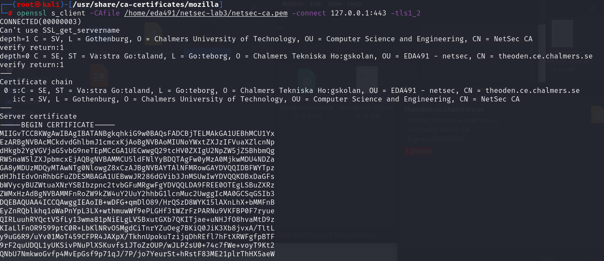

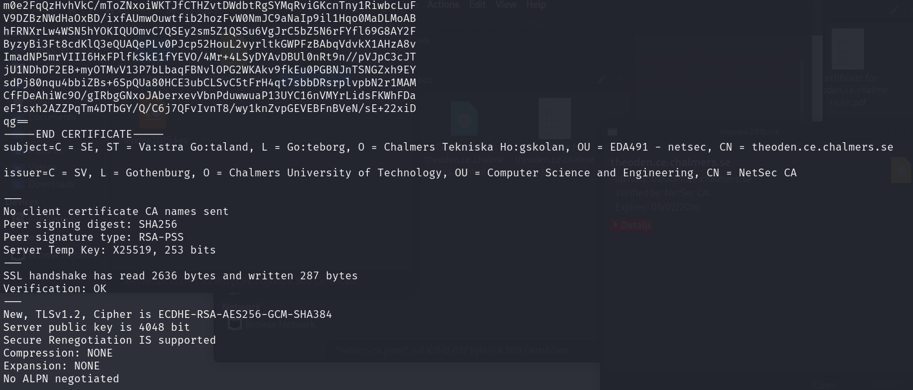

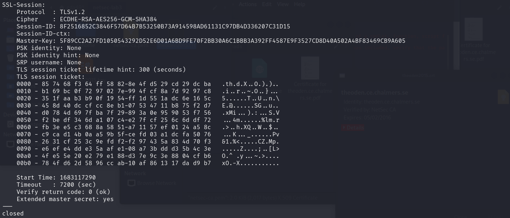


### Q7: What algorithms are used for key exchange, authentication of server, application message encryption, MAC calculation?

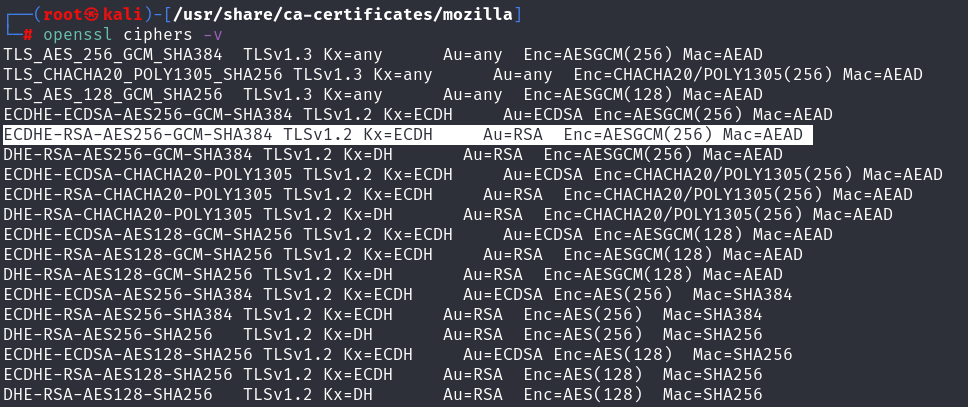

```shell
TLSv1.2, Cipher is ECDHE-RSA-AES256-GCM-SHA384
```

“Cipher is ECDHE-RSA-AES256-GCM-SHA384" refers to the cipher suite used for the connection. A cipher suite is a set of cryptographic algorithms used to secure the communication. In this case, the cipher suite consists of the following components:

- ECDHE (Elliptic Curve Diffie-Hellman Ephemeral): A key exchange algorithm that allows the client and server to generate a shared secret without revealing their private keys. Ephemeral means that a new key is generated for each connection, which provides perfect forward secrecy, preventing the decryption of previously captured traffic.
- RSA (Rivest–Shamir–Adleman): A widely used public-key encryption algorithm, used in this case for server authentication.
- AES256 (Advanced Encryption Standard with a 256-bit key): A symmetric block cipher that uses a 256-bit key size to provide strong encryption of data.
- GCM (Galois/Counter Mode): A mode of operation for symmetric encryption that provides both confidentiality and authenticity of data.
- SHA384 (Secure Hash Algorithm with a 384-bit hash): A cryptographic hash function used to verify data integrity by generating a fixed-length hash value that can be used to ensure that data has not been altered during transmission.

| key exchange                       | Elliptic Curve Diffie-Hellman Ephemeral  (ECDHE) |
| ---------------------------------- | ------------------------------------------------ |
| **authentication of server**       | **RSA**                                          |
| **application message encryption** | **AES256**                                       |
| **MAC calculation**                | **SHA384**                                       |

###  Q8: RSA with a sufficient keylength is a strong cipher. Why is RSA not used to encrypt application messages?

Because RSA encryption is relatively slow and need more computation resource compared to symmetric encryption algorithms such as AES.

### Q9: At this point you should have an established connection: is there anything strange about the TLS output? (Hint: Do not waste too much time here, ask a TA if you do not find anything after a minute or two.)

```shell
openssl s_server -accept 40123 -cert theoden2015.crt -key theoden2015.key

openssl s_client -tls1_2 -connect localhost:40123 -CAfile /home/eda491/netsec-lab3/cahome/cacert.pem
```

Certificate has expired.

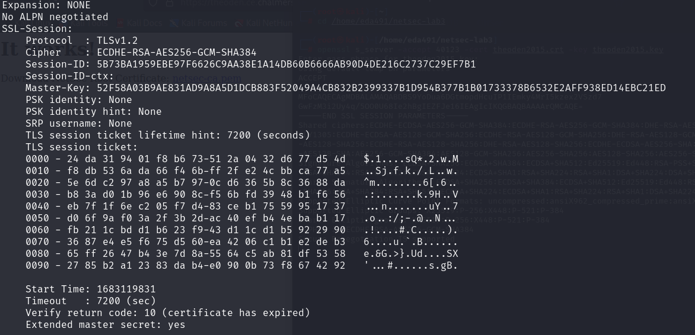

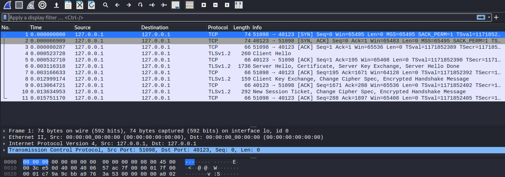

### Q10: Was the string transmitted successfully? Did you expect this to work? Why or why not?

Yes, the string was transmitted successfully.

I didn’t expect this to work, since the certificate has expired, it should not work for the sake of security.

#### sender

​	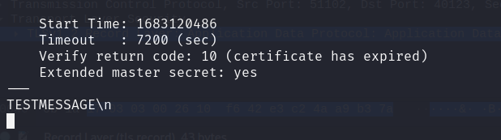

#### receiver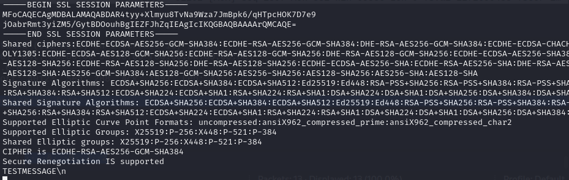


### Q11: Identify the different TLS messages in Wireshark: which messages are sent? Illustrate your answer with a diagram.

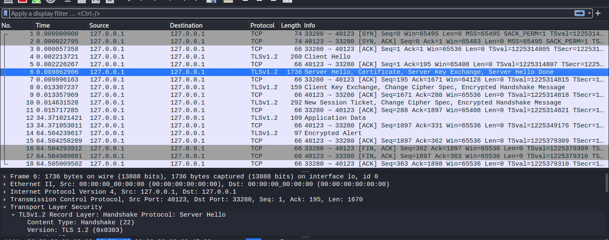

Note: The diagram below copy from the book ‘Cryptography and Network Security Principles and Practice’ by William Stallings, page 543

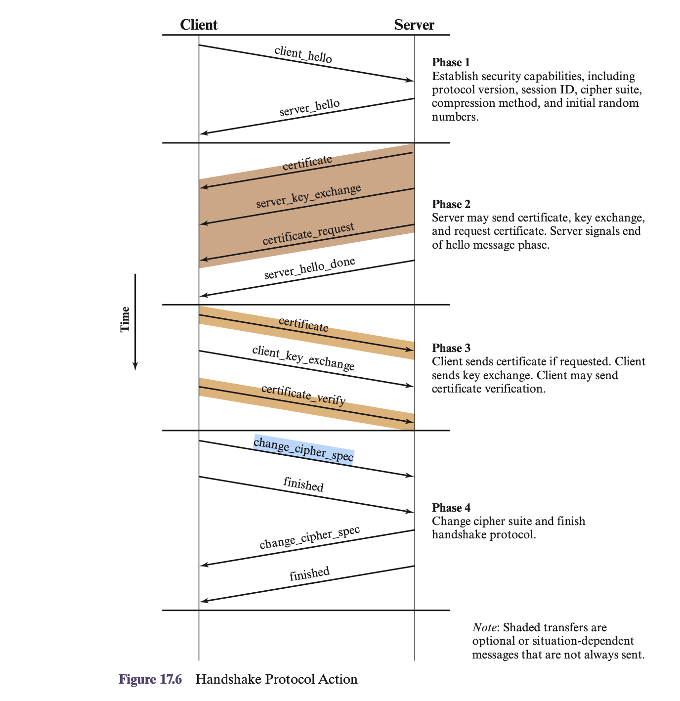

**Step 1:** **Client Hello** **-** The client initiates the handshake process by sending a Client Hello message to the server. This message includes the TLS version number, a list of cipher suites and compression methods supported by the client, and a random value that is used to generate the key material for the connection.

**Step 2: Server -**

- Upon receiving the Client Hello message, the server responds with a **Server Hello message** that includes the TLS version number, the cipher suite and compression method selected for the connection, and a random value used to generate the key material.

- The server sends its **certificate** to the client to authenticate its identity.

- the server may send additional information to the client to establish the **key exchange** parameters for the connection. For example, if the server is using Diffie-Hellman key exchange, it may send its public key to the client.

- The server sends a **Server Hello Done message** to indicate that the server hello phase is complete.

**Step 3: Client -** 

Upon receipt of the server_done message, the client should verify that the server provided a valid certificate (if required) and check that the server_hello parameters are acceptable. If all is satisfactory, the client sends one or more messages back to the server.

- **client_key_exchange message:** The client generates a premaster secret key, encrypts it using the server's public key, and sends it to the server in a Client Key Exchange message.
- **change_cipher_spec message:** Both the client and server send a Change Cipher Spec message to indicate that they will start using the newly negotiated cipher suite and encryption parameters for the remainder of the session.
- **Encrypted Handshake Message:**


**Step 4: Server -** 

- **New Session ticket:**
- **change_cipher_spec message:**
- **Encrypted Handshake Message:**


### Q12: Which ciphers are proposed by your client. Where can we find this information?

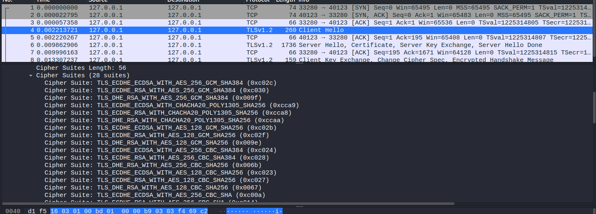

### Q13: Which cipher is selected by the server? Why is it selected? Where can we find this information?

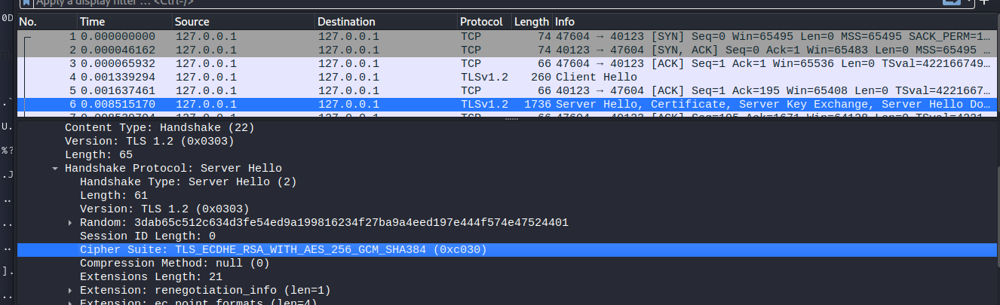

The server may prefer to use certain cipher suites that are more secure and more secure or efficient.

### Q14: Which TLS message do you think contains the string “TESTMESSAGE”?

In application data packet above.
