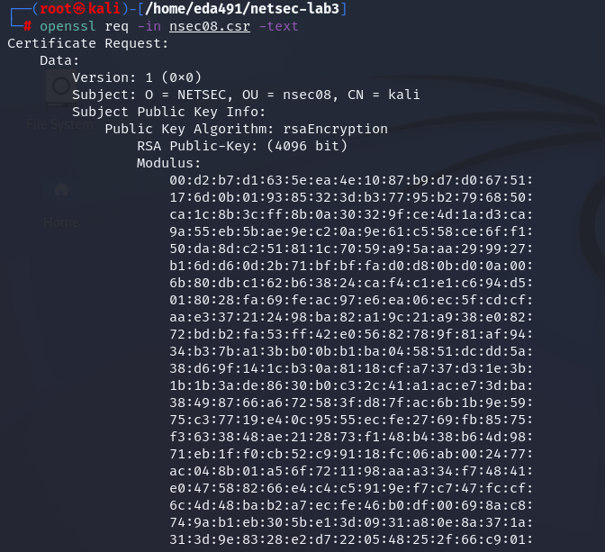
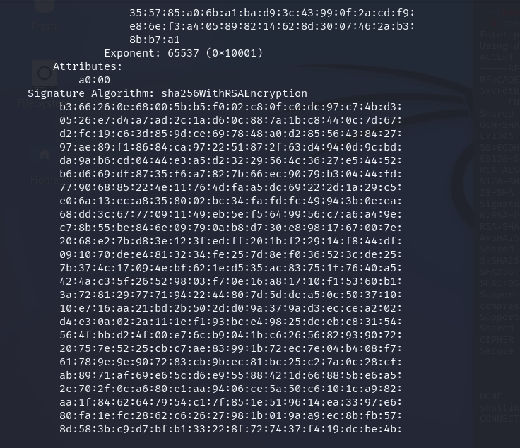
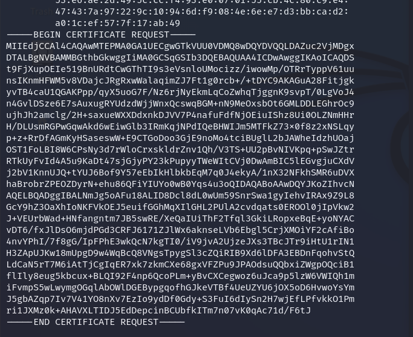
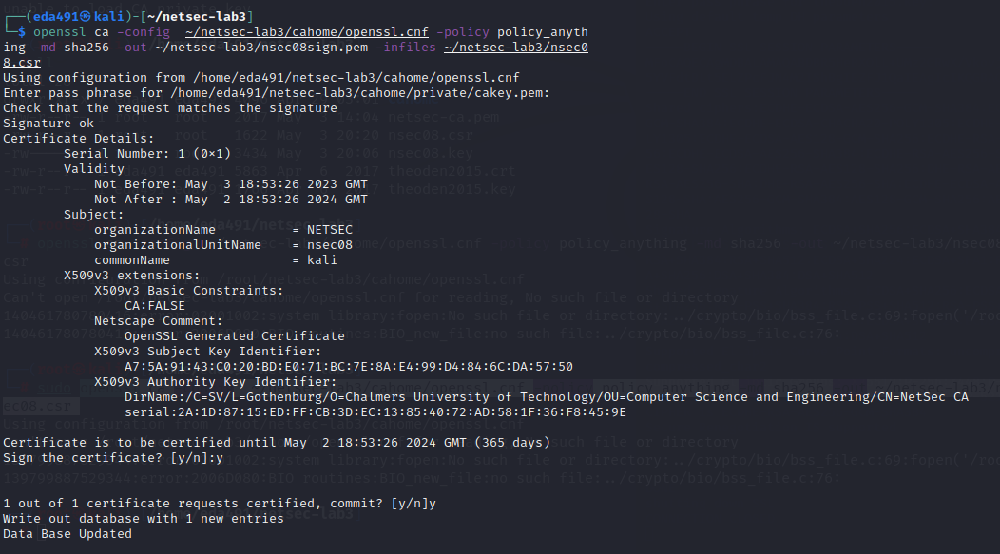
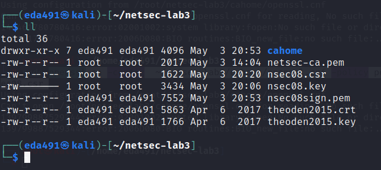
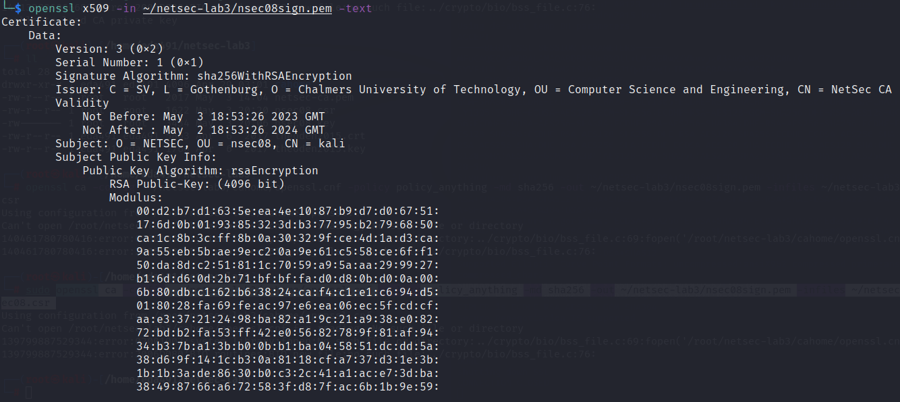
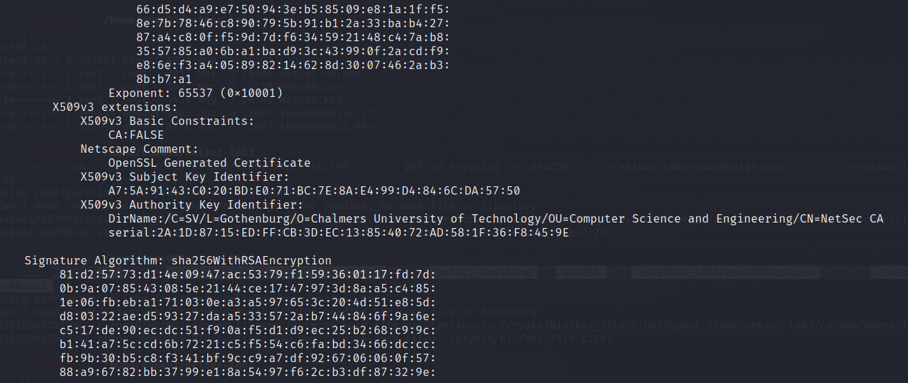
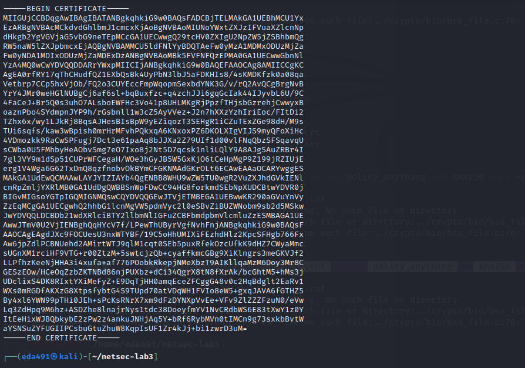

# Part 3: Creating and signing certificates

In the following you will use OpenSSL to create certificates to authenticate a server. You will also gain some insight into how a Public Key Infrastructure can provide trust by using a trusted CA to sign a server certificate.

### Q15: What are the implications of making the CA’s private key public?

If an attacker gains access to the CA's private key, they could use it to issue fake certificates, impersonate trusted entities, and intercept and decrypt encrypted communications. 

This would allow the attacker to conduct Man-in-the-Middle (MITM) attacks and compromise the confidentiality and integrity of all communications protected by the PKI system.

Here's **how an MITM attack could occur** after the attacker knows the CA's private key:

1. The attacker intercepts the communication between the client and the server.
2. The attacker generates a fraudulent certificate for the server's domain using the CA's private key that they have obtained.
3. The attacker sends the fraudulent certificate to the client and pretends to be the server.
4. The client trusts the fraudulent certificate because it is signed by the trusted CA.
5. The client encrypts the data with the attacker's public key and sends it to the attacker.
6. The attacker decrypts the data using their private key, reads the information, possibly modifies it, re-encrypts it using the server's public key, and forwards it to the server.
7. The server decrypts the data and receives the modified information from the attacker, believing it came directly from the client.

### Q16: Why would you encourage public sharing of the CA’s certificate when the private key must be kept secret?

- By sharing the CA's certificate publicly, clients can verify that the digital certificates issued by the CA are legitimate and can be trusted. This helps to establish trust between the clients and the CA.

- Sharing the CA's certificate publicly promotes transparency and accountability by allowing anyone to verify the CA's identity and the certificates it has issued.

### Q17: What is verified when using the openssl library when a TLS connection is being established? (Hint: It checks five related things, provide at least three.)

- **Certificate chain:** The OpenSSL library checks the certificate chain of the server's  certificate to ensure that it is valid and trusted. This involves verifying that the server's certificate is signed by a trusted Certificate Authority (CA) and that the intermediate certificates in the chain are also valid and trustworthy.

- **Date and time:** The OpenSSL library checks the date and time on the server's  certificate to ensure that it is valid and has not expired.

- **Hostname:** The OpenSSL library checks the hostname in the server's certificate to ensure that it matches the hostname of the server being accessed. This helps to prevent Man-in-the-Middle (MITM) attacks where an attacker intercepts the connection and poses as the intended server.

- **Cipher suites:** The OpenSSL library checks the available cipher suites offered by the server to ensure that they are strong and secure.

- **Revocation status:** The OpenSSL library checks the revocation status of the server's digital certificate to ensure that it has not been revoked by the issuing CA.


Three different methods exist for creating a certificate. The methods are called **Self-signed certificate**, **Certificate signed by a trusted CA** and **Certificate signed by a local CA**. In this assignment we are going to use a local CA to sign our server certificate。

### Q18: Compare the output to the unsigned request you saved earlier. In what ways do the outputs differ?

```shell
# generates a new 4096-bit RSA private key and encrypts it using AES256 symmetric encryption with a password. 

openssl genpkey -aes256 -algorithm RSA -out nsec08.key -aes256 -pkeyopt rsa_keygen_bits:4096

# create a new certificate request (nsec08.csr) using the private key (nsec08.key). The request will be signed with a SHA256 message digest and the subject of the certificate will contain the specified fields: O=NETSEC, OU=nsec08, and CN=kali.
openssl req -new -key nsec08.key -out nsec08.csr -sha256 -subj "/O=NETSEC/OU=nsec08/CN=kali"

# print the certificate request in human readable form, and verify that you provided the correct parameters
openssl req -in nsecXX.csr -text
```







- `openssl genpkey`: This invokes the OpenSSL command-line tool to generate a private key.
- `-aes256`: This option specifies that the private key should be encrypted using AES256 symmetric encryption.
- `-algorithm RSA`: This option specifies that the private key should use the RSA algorithm.
- `-out nsec08.key`: This option specifies the output filename for the private key. In this case, the filename is `nsec08.key`.
- `-pkeyopt rsa_keygen_bits:4096`: This option sets the key size to 4096 bits, which is a recommended key length for RSA.

```shell
# Note: don't run this command in root
openssl ca -config  ~/netsec-lab3/cahome/openssl.cnf -policy policy_anything -md sha256 -out ~/netsec-lab3/nsec08sign.pem -infiles ~/netsec-lab3/nsec08.csr
```





```shell
openssl x509 -in ~/netsec-lab3/nsec08sign.pem -text
```







**Difference:**

- Issuer (added)

- Validity (added)

- X509v3 extensions (added)

- Begin certificate request -> Begin certificate

  

### Q19: Consider the following scenario: You need to buy something and you search the web for more information. After a while you find a small and unknown (at least to you) web-shop which has the lowest price. What a great price, you think! You also see that they have an https connection, and the little lock in your browser is closed (i.e., the server certificate is validated, with a signature by some CA). When you are about to enter your credit card details, you ask yourself...

1. Does the CA’s signature imply that you can trust the person who holds the server certificate (the web shop)?
2. Can you trust the server that holds the certificate? For instance, do you believe the information you enter will be kept secure?

**Answer:**

1. **It does not  imply that you can trust the person running the web shop.** The certificate only verifies the identity of the domain, not the identity of the organization or individual behind the domain.
2. The fact that the website has an https connection and a validated server certificate with a closed lock icon in the browser does provide some assurance that the information entered will be kept secure in transit between your browser and the web server. However, **it does not guarantee that the server itself is secure or that the web shop is legitimate.** 

