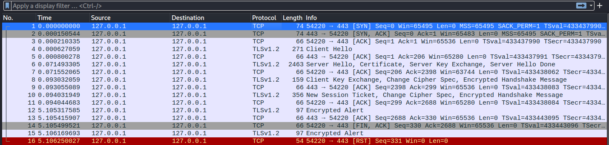
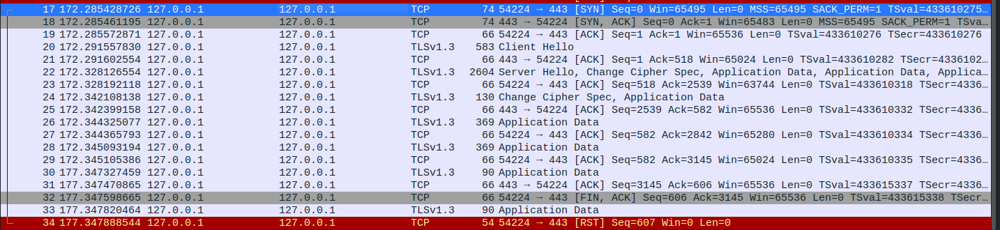
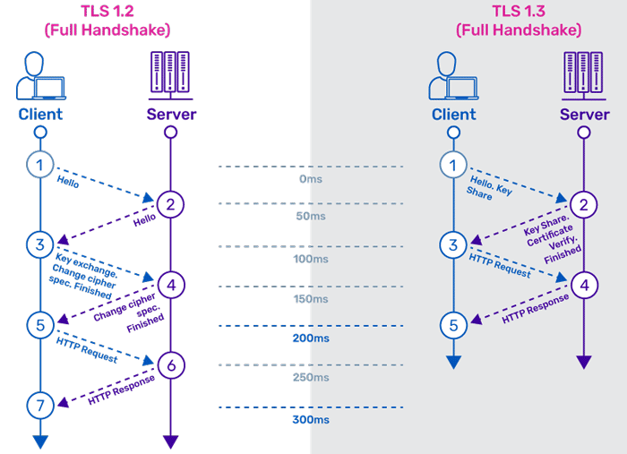
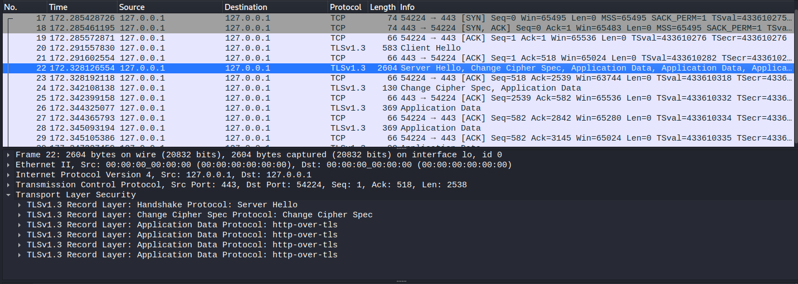

# Part 4: Comparing TLS1.2 and TLS1.3 Handshakes

In this part you are going to compare the handshakes of TLS1.2 and TLS1.3.

### Q20: Which differences can you observe?

**TLS1.2**

**TLS1.3**

### Q21: When does each version start sending encrypted messages?

**In TLS 1.2**, after the "finished" message is exchanged, the client and server can start sending encrypted messages using the agreed-upon cipher suite.

**In TLS 1.3**, encrypted messages are sent right after the handshake messages, without requiring a "finished" message. This is known as "0-RTT" or "early data" and allows clients to send data as soon as possible without waiting for confirmation of the handshake's success.

**A significant difference has happened in the Server Hello in TLS 1.3 — it is encrypted.**

At the moment of receiving the Client Hello, the server has all required parameters for generating the master secret, including:

- Client Key Share
- Server Key Share
- Client Random
- Server Random

Therefore, the server can generate the master secret, encrypts the Server Hello message, and finally sends it to the client.

### Q22: Finally, if you remember only one thing from this lab, what should it be? (There is no right answer here.)

