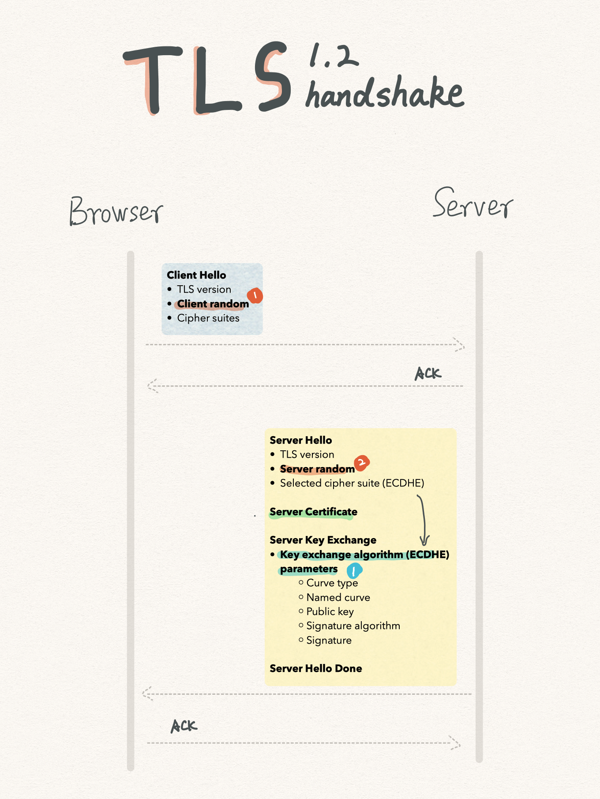
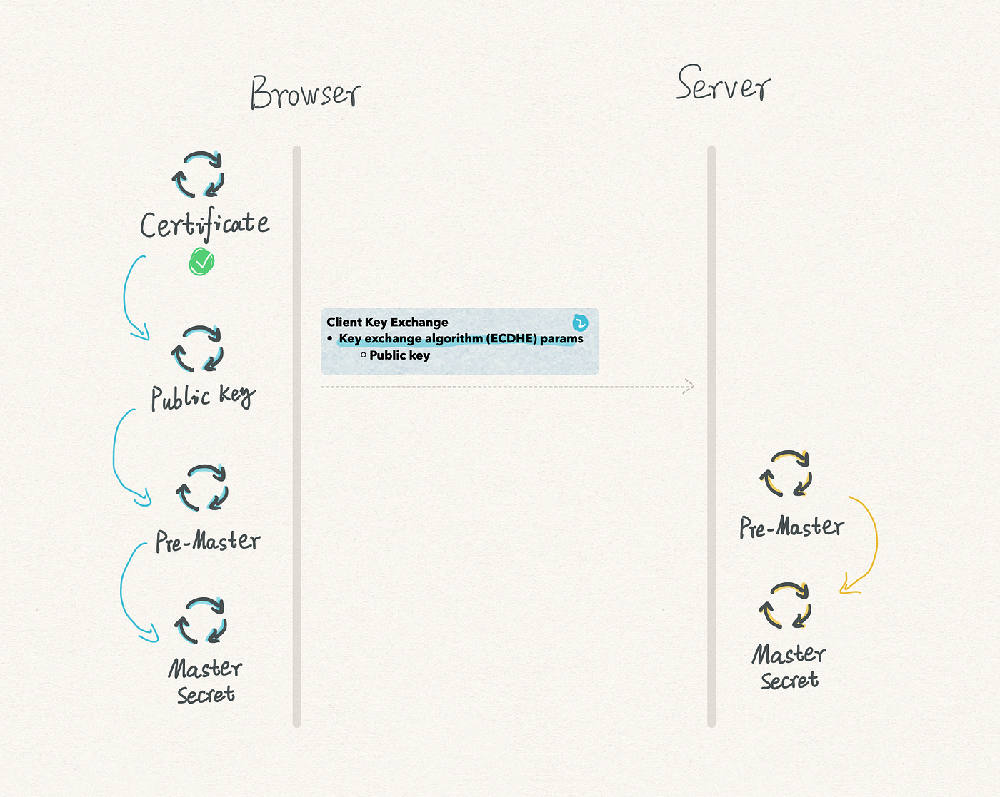
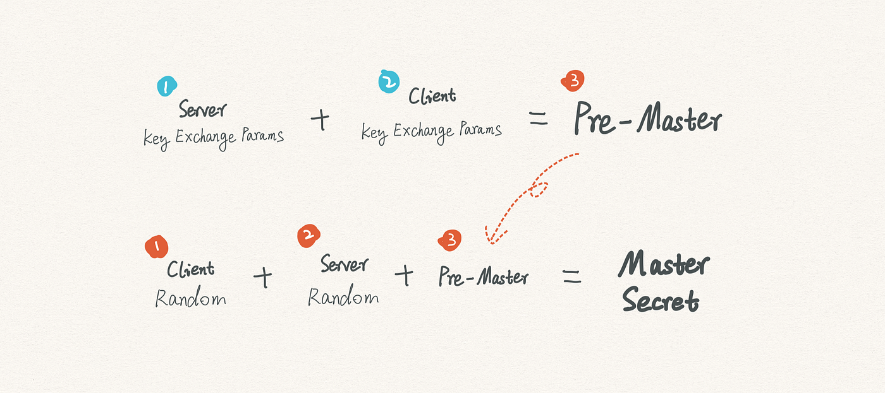
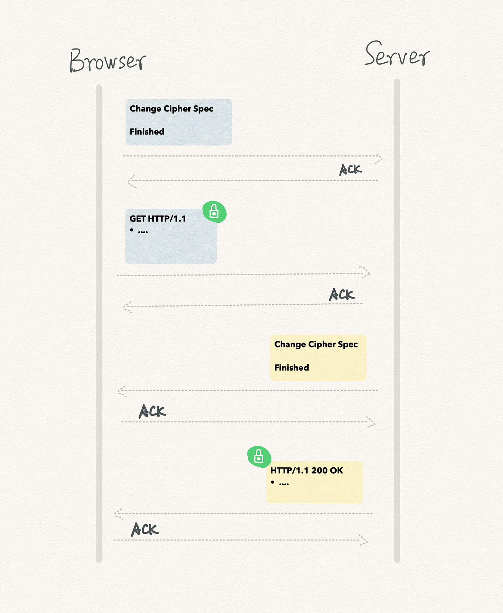
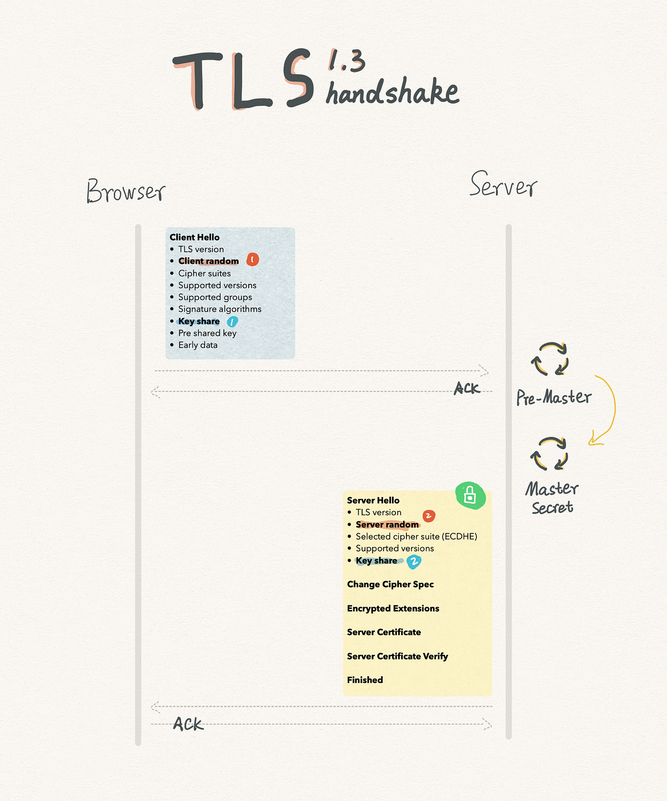
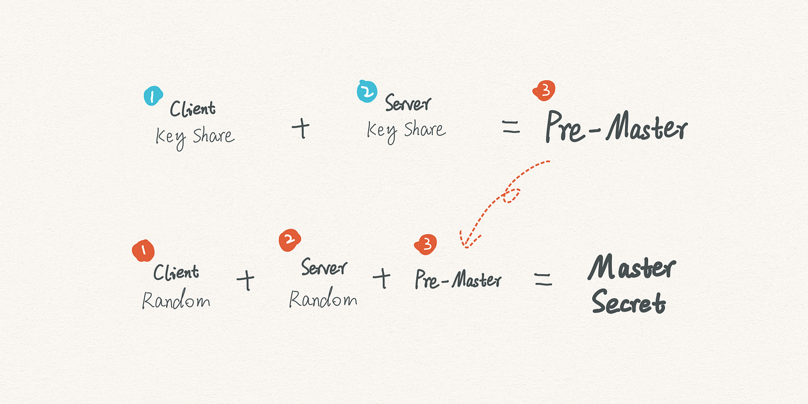
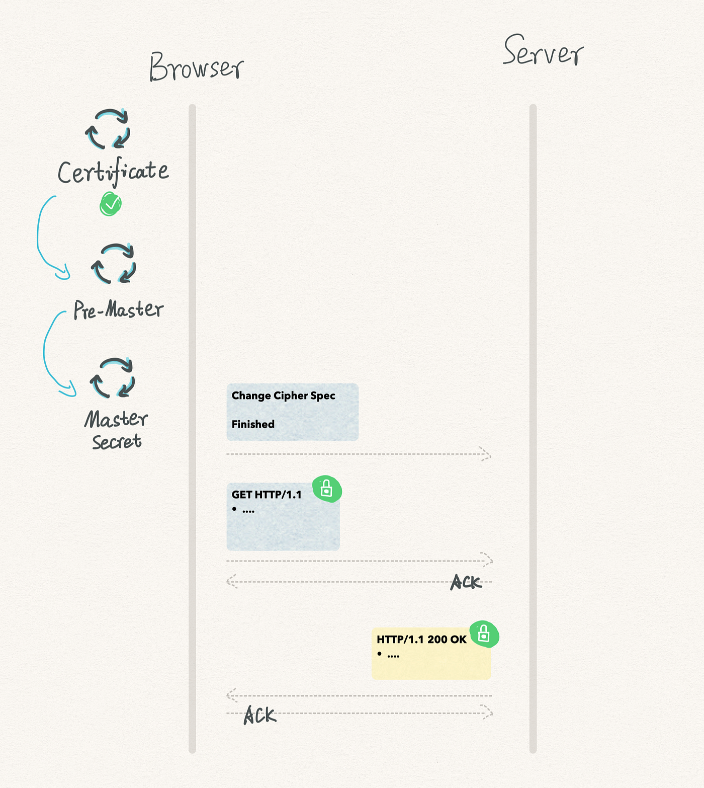

### [TLS 1.2 and TLS 1.3 Handshake Walkthrough](https://cabulous.medium.com/tls-1-2-andtls-1-3-handshake-walkthrough-4cfd0a798164)

The ultimate goal of the TLS handshake is safely exchanging the master secret for future secure communication.

## TLS 1.2 Handshake

It takes 4 steps to complete the handshake before sending the first encrypted request from a browser:

1.  Client Hello
2.  Server Hello
3.  Client key exchange and generate the master secret
4.  Finished

Let’s take a look at the details.



## Step 1 — Client Hello

The handshake starts with the Client Hello message from the browser. The message includes:

-   the TLS version,
-   a 28-byte random number (Client Random), and
-   a list of cipher suites.

The random number is essential, and we will use it later. Let’s put it aside for now.

## Step 2 — Server Hello

After receiving Client Hello, the server starts preparing Server Hello.

-   It checks if the TLS version is a valid one.
-   It saves the Client Random and puts it aside.
-   It generates another 28-byte random number (Server Random).
-   It picks a preferred cipher suite from the list. TLS recommends using ECDHE (Ephemeral Elliptic-curve Diffie–Hellman) as the key exchange algorithm. An example of suggested cipher suites is `TLS_ECDHE_RSA_WITH_AES_256_GCM_SHA384`.
-   It adds a server certificate to prove its identity.
-   Since ECDHE is selected, it puts key exchange algorithm params to the message. This is required for the next step.
-   A signature, encrypted by the server’s private key, is attached to the param list for additional identity verification.

Finally, the server sends the Server Hello message.

## Step 3 — Client key exchange and generate the master secret



The next step is all about the browser.

-   It verifies the server’s identity with the server certificate.
-   Also, it verifies the signature in the key exchange algorithm params.
-   If all go well, the browser creates a public key and adds it to the key exchange algorithm params. It is mandatory for the next step.

Until now, both sides have all the required parameters and ready to generate the master secret independently.



A pre-master is generated with the key exchange params from the server (step 2) and the client (step 3).

Next, a master secret is created based on the pre-master, the client random (step 1), and the server random (step 2).

Actually, the master secret is not the session key for communication. Both sides will use a pseudo-random function to generate more keys based on the master secret, such as a client session key and a server session key.

Why? It enhances security.

The process is vulnerable if we use and only use the master secret directly for all encryption. Using multiple keys and constantly changing keys in each communication avoid the issue.

## Step 4 — Finished



Once the master secret is ready, the browser sends a Change Cipher Spec message letting the server know that all the future messages will be encrypted.

In the Finished message, the browser includes an encrypted digest of all previous messages. With it, the server can verify whether the encryption is expected.

Finally, the server sends a similar Change Cipher Spec message and the Finished message for encryption verification.

An interesting thing happens here.

The browser sends its first encrypted request before receiving the server’s Finished message, saving the time to wait for the last message.

This is called the **TLS False Start**.

Now the handshake is done, and we are communicating in HTTPS.

## TLS 1.3 Handshake

TLS 1.2 came out in 2008 and is getting old.

On March 21st, 2018, TLS 1.3 was finalized, bringing safer communication, better performance, and compatibility with TLS 1.2.

## Extensions

To be compatible with the previous version, TLS 1.3 introduces the extensions. TLS 1.2 simply ignores them.

To better understand it, let’s look at an example of the extensions in TLS 1.3.

```
Handshake Protocol: Client Hello
  Version: TLS 1.2 (0x0303)
	Extension: supported_versions (len=11)
	    Supported Versions length: 10
	    Supported Version: TLS 1.3 (0x0304)
	    Supported Version: TLS 1.2 (0x0303)
	    Supported Version: TLS 1.1 (0x0302)
	    Supported Version: TLS 1.0 (0x0301)
```

This is a Client Hello message. The `Version` value at the second line is not a typo. It is necessary for a TLS 1.3 message disguises itself as a TLS 1.2 one.

Why? In early tests, developers realized that updating the value in `Version` is next to impossible. Changing it from 0x0303(TLS 1.2) to 0x0304 (TLS 1.3) makes TLS handshake fail on lots of proxies and gateways.

The newcomer has to compromise, putting its supported version in `Extension: supported_versions`.

In the example, you can see a list of supported versions. If a server doesn’t support TLS 1.3, it will fall back to TLS 1.2 in the list.

## Safer Communication

In the last decade, developers have noticed quite a few vulnerabilities in encryption algorithms. Some of them are deprecated in TLS 1.3, including:

-   RSA and DH key exchange algorithms and many named curves
-   RC4 and DES symmetric-key encryption algorithms and ECB and CBC modes
-   MD5, SHA1, and the SHA-224 digest algorithm

By deprecating them, TLS 1.3 shorten its supported cipher suites from 37 (in TLS 1.2) to 5.

-   `TLS_AES_128_GCM_SHA256`
-   `TLS_AES_256_GCM_SHA384`
-   `TLS_CHACHA20_POLY1305_SHA256`
-   `TLS_AES_128_CCM_SHA256`
-   `TLS_AES_128_CCM_8_SHA256`

## Better Performance

Thanks to the shortened list of cipher suites, a browser can now put everything a server needs in one message with the extensions. We don’t need the step for Client Key Exchange anymore.



Let’s take a look at an example of the new Client Hello.

```
Handshake Protocol: Client Hello
  Version: TLS 1.2 (0x0303)
  Random: d06068b9b0a6a451949f02b55683dfcceecf95d49cbd4e9e273f8f3f453462ea
  Cipher Suites (27 suites)
	Cipher Suite: TLS_AES_128_GCM_SHA256 (0x1301)
	Cipher Suite: TLS_AES_256_GCM_SHA384 (0x1302)
	Cipher Suite: TLS_CHACHA20_POLY1305_SHA256 (0x1303)
  ...
  Extension: supported_groups (len=12)
	Supported Groups (5 groups)
	    Supported Group: x25519 (0x001d)
	    Supported Group: secp256r1 (0x0017)
	    Supported Group: secp384r1 (0x0018)
	    Supported Group: secp521r1 (0x0019)
  Extension: key_share (len=107)
	Key Share extension
	    Client Key Share Length: 41
	    Key Share Entry: Group: x25519, Key Exchange length: 32
	    ...
  Extension: supported_versions (len=11)
	Supported Versions length: 10
	Supported Version: TLS 1.3 (0x0304)
	Supported Version: TLS 1.2 (0x0303)
	Supported Version: TLS 1.1 (0x0302)
	Supported Version: TLS 1.0 (0x0301)
```

-   `supported_groups` is for supported named curves, such as P-256 and x25519. By the way, x25519 is a high-performance curve and should be your choice if possible.
-   `key_share` is for the client's public key params.
-   `signature_algorithms` is for the signature algorithm.

Next, the server replies with a Server Hello as it does in the TLS 1.2 handshakes. Here is an example of the message.

```
Handshake Protocol: Server Hello
    Version: TLS 1.2 (0x0303)
    Random: b0a37492143def6d4959205dfe6fd620d93baa7ba89e1593e8cb60d6497537d4
    ...
    Cipher Suite: TLS_AES_128_GCM_SHA256 (0x1301)
    ...
    Extension: supported_versions (len=2)
        Supported Version: TLS 1.3 (0x0304)
    Extension: key_share (len=36)
        Key Share extension
	    Key Share Entry: Group: x25519, Key Exchange length: 32
	    Group: x25519 (29)
	    Key Exchange: 105aaf79c1f424cdc9352723a4dea7db65568a229c091d3fd8a700da883bd15e
```

Other than Server Random, the additional relevant information is in the extensions.

-   In the `Supported Version`, the server confirms using TLS 1.3.
-   `Key Share` has the selected named curve and key exchange params.



A significant difference has happened in the Server Hello in TLS 1.3 — it is encrypted.

At the moment of receiving the Client Hello, the server has all required parameters for generating the master secret, including:

-   Client Key Share
-   Server Key Share
-   Client Random
-   Server Random

Therefore, the server can generate the master secret, encrypts the Server Hello message, and finally sends it to the client.

TLS 1.3 is one step ahead of TLS 1.2 in sending an encrypted message. It means less information a hacker can steal in the handshake process.



Once receiving the Server Hello, the browser can generate the same master secret, sends its Change Cipher Spec message and

-   verifies the server’s certificate,
-   generates the same master secret, and
-   sends its Change Cipher Spec and Finished message.

All set. The browser can now start communicating with the server over HTTPS.

## Join Medium

Purchasing Medium Membership through the above link means that I can get income through the referral link. This does not mean that you have to buy from the link, nor does I deny or oppose other channels. It is your right to know.

## Further Reading

-   Interested in the TLS False Start? Take a look at [https://tools.ietf.org/html/rfc7918](https://tools.ietf.org/html/rfc7918)
-   If you are wondering why a hacker cannot generate a pre-master by intercepting client params and server params, take a look at [https://en.wikipedia.org/wiki/Elliptic-curve\_Diffie–Hellman](https://en.wikipedia.org/wiki/Elliptic-curve_Diffie%E2%80%93Hellman)
-   An overview of TLS 1.3 from OWASP [https://owasp.org/www-chapter-london/assets/slides/OWASPLondon20180125\_TLSv1.3\_Andy\_Brodie.pdf](https://owasp.org/www-chapter-london/assets/slides/OWASPLondon20180125_TLSv1.3_Andy_Brodie.pdf)