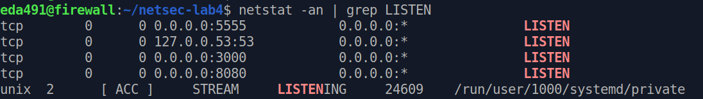
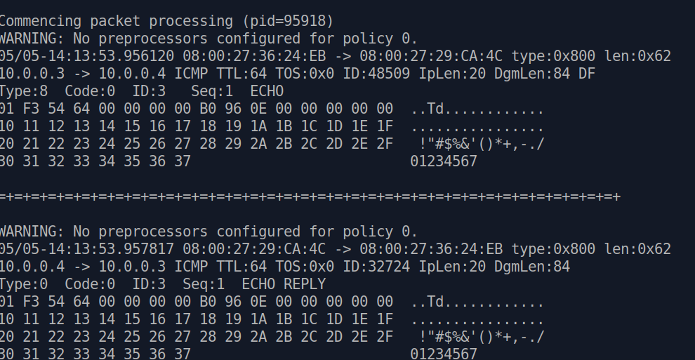
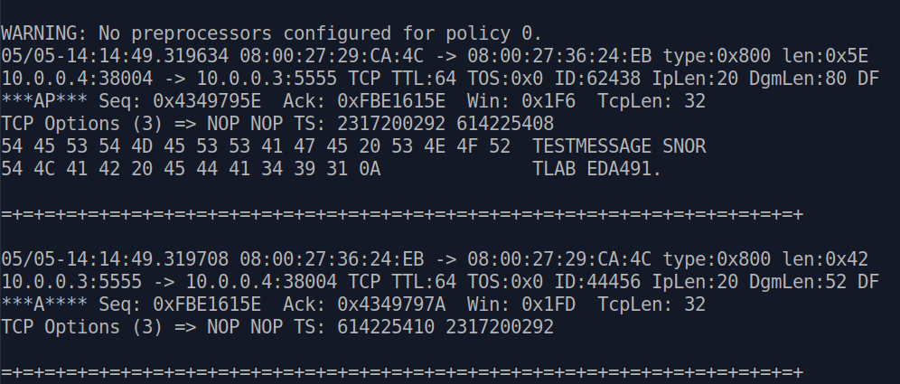
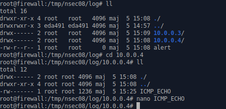
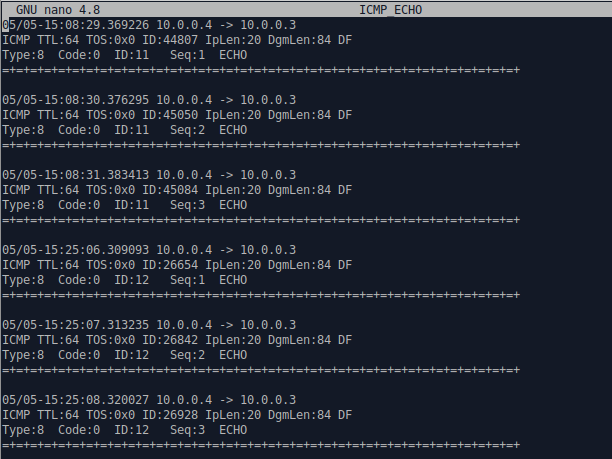
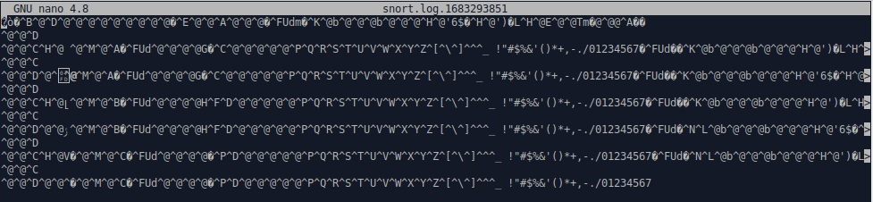
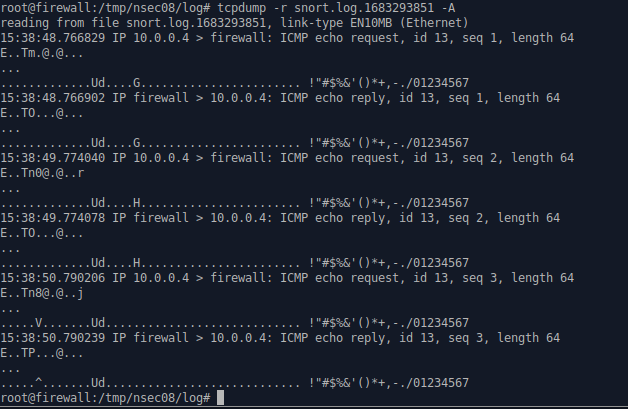

# 7.1 Snort in sniffer and packet logger modes

### 7.1.1 Sniffer Mode

```shell
# First, start server1 and server2 located in /home/eda491/netsec-lab4 on firewall
sudo sh /home/eda491/netsec-lab4/prepare.sh

# then check it
netstat -an | grep LISTEN
```



```shell
# Start Snort in sniffer mode
# By default, Snort will capture all traffic on the specified interface. You can customize the types of traffic that Snort captures by modifying the rules in your Snort configuration file (usually snort.conf).
sudo snort -i enp0s3

# Kill the snort process
sudo pkill -9 snort
```

**Capture link layer & network layer**

```shell
# firewall config
# First, let's start with the basics. If you just want to print out the TCP/IP packet headers to the screen (i.e. sniffer mode), try this:
#    ./snort -v
# This command will run Snort and just show the IP and TCP/UDP/ICMP headers, nothing else. If you want to see the application data in transit, try the following:
#    ./snort -vd
# This instructs Snort to display the packet data as well as the headers. If you want an even more descriptive display, showing the data link layer headers, do this:
#    ./snort -vde
sudo snort -i enp0s3 -vde

# attacker
ping 10.0.0.3
```



**Capture transport layer & payload** 

```shell
# attacker, connect and send message 'TESTMESSAGE SNORTLAB EDA491' to the firewall
echo TESTMESSAGE SNORTLAB EDA491 | nc 10.0.0.3 5555
```




#### Q1: To see the string, you had to add the payload option, but when the payload was captured, the output increased in size. Elaborate briefly whether payload data should be captured (consider log sizes, attack coverage, and amount of traffic passing the IDS).

The payload data in Snort logs can provide valuable information for analyzing network activity. However, capturing the payload can also significantly increase the size of the log files, which can make it more difficult to store and analyze the data.

- **Log size:**  Storing all of payload data can quickly lead to large log files that are difficult to manage and analyze. Therefore, it's important to consider the available storage capacity.
- **Attack coverge: ** Capturing payload data can improve the coverage of the IDS for certain types of attacks. However, capturing the payload may not be necessary for all types of attacks, and it may not always be the most efficient way to detect them.
- **amount of traffic passing the IDS:** In high-traffic environments, capturing the payload data can significantly increase the processing overhead of the IDS and impact its performance. Therefore, it may be more practical to capture only specific types of payloads or to limit the capture to certain parts of the network where suspicious activity is more likely to occur.


**Store packets in ASCII  format**

```shell
# Note:
ASCII format typically contains detailed information about each captured packet such as the source and destination IP addresses, the protocol used and other fields which provides additional information about the packet, such as TTL, TOS, ID, and length of the IP packet that is IpLen.

# on Firewall VM, config output format ascii
sudo snort -i enp0s3 -c /home/eda491/netsec-lab4/snort.conf -l /tmp/nsec08/log -k none -K ascii

# on Attacker,
ping 10.0.0.3
```

​	

​	

**Store packets in pcap  format**

```shell
# Note:
PCAP logs are usually encrypted.  To convert these logs in human-readable format, we need tools such as wireshark and tcpdump. Wireshark can decode the binary packet data and display it in a human-readable format. We have used tcpdump.

# on Firewall VM, config output format ascii
sudo snort -i enp0s3 -c /home/eda491/netsec-lab4/snort.conf -l /tmp/nsec08/log -k none -K pcap

# or using the following command
sudo snort -i enp0s3 -c /home/eda491/netsec-lab4/snort.conf -l /tmp/nsec08/log -k none -b

# on Attacker,
ping 10.0.0.3
```

​	

**raw pcap file**



```shell
# tcpdump displays the PCAP log on the terminal in human readable format. 
tcpdump -r snort.log.1683293851 -A
```

**after using tcpdump**

​	


#### Q2: Elaborate briefly on storing log files in ASCII and pcap format. When would it be more suitable to store the files in ASCII, and when would it be more suitable to store the files in pcap format? Is there a difference in the way the log files are named?

**ASCII**

- **ASCII format logs** are **easy to read and analyse** using text editors or command-line tools, and they can be easily searched, sorted, and filtered based on specific criteria. They are also **relatively small in size** compared to pcap files, making them easier to store and manage.
  - Each log entry is represented as a single line of text that contains the date and time of the event, the source and destination IP addresses and ports, the protocol used, and other relevant information
  - **Do not contain the payload of the network packets** that triggered the rule.
  

**PCAP**

- **pcap format** is a binary format that stores Snort log data in a packet capture file. 
  - Each log entry is represented as a captured network packet that contains all the information about the network activity, **including the packet payload**.
  - Pcap files are ideal for analyzing network traffic using packet analysis tools such as Wireshark, tcpdump, or Snort itself.
  -  They are also useful for replaying network traffic for testing or debugging purposes. 
  - However, pcap files are generally **larger in size** compared to ASCII logs, making them more difficult to store and manage.


