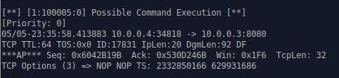

## 7.2 Snort in intrusion detection mode

#### 7.2.1 Suspect 1:

```shell
# suspect1
./execute suspect1 10.0.0.3


```


In the suspect1 attack, we have observed that the attacker pushes the payload towards the firewall. Attack can impact the firewall with IDS if the attacker is successful in sending lot of meaningless data to the firewall which has intrusion detection system. Some example of the negative impact are, network slowdown, IDS overload which effects the performance of the IDS system, and resource exhaustion etc.

**Add rules to discover attacks**


#### 7.2.2 Suspect 2: Xmas Attack

```shell
# suspect2
./execute suspect2 10.0.0.3
```


In the suspect2 attack, the attacker seems to **inject the XMAS attack.** The XMAS attack has a TCP packet with the URG, PUSH, and FIN flags set. These flags are also used in normal TCP traffic but they are not usually used together in a single packet.

**Add rules to discover attacks**

```SHELL
alert tcp any any -> $HOME_NET any (flags: FPU; msg:"XMAS Attack Detected"; sid:100004;)
```

​	


#### 7.2.3 Suspect 3: Execute the command on the Windows system


```shell
# suspect3
./execute suspect3 10.0.0.3
```


In suspect3 attack, the attacker uses the "PUSH ACK" flag in combination with a malicious payload. This payload seems to exploit a vulnerability in a web server or application. This could lead to remote code execution on the target system. The "PUSH ACK" flag set with a combination of the commands such as GET is used to retrieve a file from the target system or execute a command on it. In this case, **we see that the attacker is attempting to execute the "dir" command on the Windows system, which can be used to list the contents of a windows directory.** The attacker here try to attempt downloading or uploading files, modify system settings, or install malware on to the target system. This type of attack can be severe as the attacker could compromise the target system, or have unauthorized access to sensitive data, and disruption of critical services.

​	

**Add rules to discover attacks**

```shell
# Detect possible command execution over HTTP traffic
var HTTP_PORTS 8080,80,443

alert tcp any any -> $HOME_NET $HTTP_PORTS (flags: PA;content:"/c"; content:"/system32"; within:15; msg:"Possible Command Execution"; sid:100005)
```

- `flags: PA`: This specifies that the rule will only match TCP packets with the PSH and ACK flags set. This is because the rule is looking for a specific sequence of bytes that might not appear until a TCP segment is complete and pushed.
- `content:"/c";`: This looks for the presence of the string "/c" in the payload of the TCP segment. This is the command line switch for the Windows Command Prompt to execute a command.
- `content:"/system32";`: This looks for the presence of the string "/system32" in the payload of the TCP segment. This is the default location of many important system files and binaries on a Windows system.
- `within:15`: This specifies that the two content matches must be within 15 bytes of each other. This is to ensure that they are part of the same command being executed.
- `msg:"Possible Command Execution";`: This is the message that will be logged when the rule is triggered.
- `sid:100005`: This is the unique identifier for the rule.




#### 7.2.4 Suspect 4:


```shell
# suspect4
./execute suspect4 10.0.0.3
```


#### 7.2.5 Suspect 5:


```shell
# suspect5
./execute suspect5 10.0.0.3
```


We have observed from the wireshark logs that in suspect5 attack, the SYN (TCP synchronization) and ECN (Explicit Congestion Notification) flags are sent together repetitively to the destination from different IP addresses. This type of network attack can lead to a more sophisticated and impactful form of denial-of-service (DoS) attacks. Some potential impact of this attack can be 'amplification attack', and 'resource exhaustion'. From the literature review we found that it may require more sophisticated mitigation techniques as well as higher network capacity to handle the increased traffic and congestion notifications effectively.

#### Q3: In this assignment, you have written specific rules to discover attacks. This paradigm is known as signature-based detection. Another paradigm for intrusion detection is called anomaly-based detection. Elaborate on the advantages and disadvantages of each.

Signature-based detection is based on predefined signatures or patterns of known malicious activities to identify threats. 
It compares network traffic or system events against a signature database and triggers alerts when a match is found. 
It is effective in detecting known threats but may struggle with new or unknown attacks.

Anomaly-based detection however focuses on detecting deviations from normal behavior or baselines. 
Anomaly-based detection establishes a baseline of normal activity and generates alerts (Intrusion Detection System) or takes action (Intrusion Detection and Handling System) when abnormal behavior or suspicious activity is detected. 
It is effective in detecting previously unseen attacks but may generate more false positives and also require more resources.


#### Q4: If you remember only one thing from this lab, what should it be?
Making rules can be cumbersome. In signature-based detection the rules set should be generalized as much as possible to detect alicious activities on the network.
