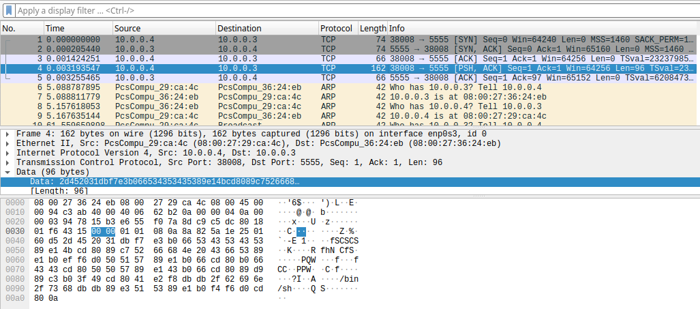
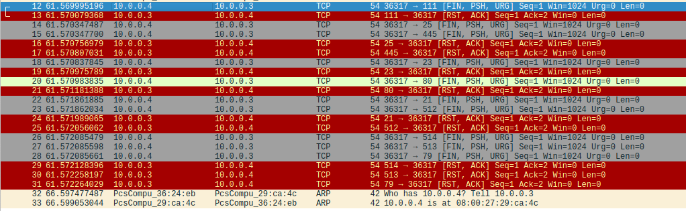
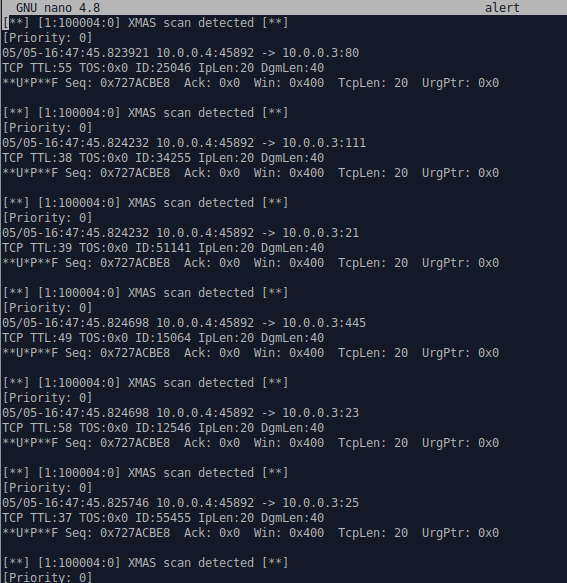
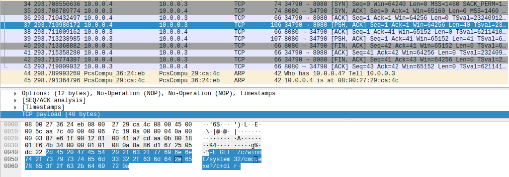
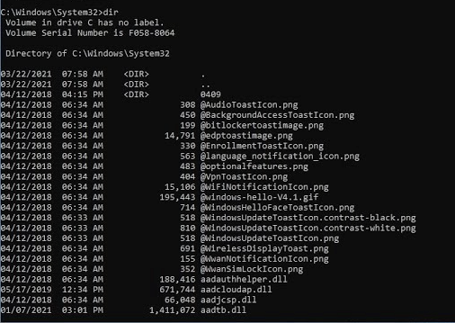
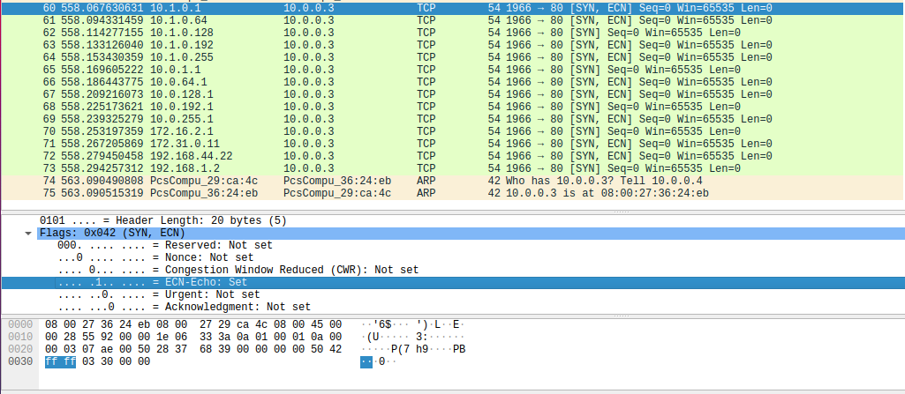

# 7.2 Snort in intrusion detection mode

#### Suspect 1:

```shell
# suspect1
./execute suspect1 10.0.0.3


```



In the suspect1 attack, we have observed that the attacker pushes the payload towards the firewall. Attack can impact the firewall with IDS if the attacker is successful in sending lot of meaningless data to the firewall which has intrusion detection system. Some example of the negative impact are, network slowdown, IDS overload which effects the performance of the IDS system, and resource exhaustion etc.

**Add rules to discover attacks**


#### Suspect 2: Xmas Attack

```shell
# suspect2
./execute suspect2 10.0.0.3
```



In the suspect2 attack, the attacker seems to **inject the XMAS attack.** The XMAS attack has a TCP packet with the URG, PUSH, and FIN flags set. These flags are also used in normal TCP traffic but they are not usually used together in a single packet.

**Add rules to discover attacks**

```SHELL
alert tcp any any -> $HOME_NET any (flags: FPU; msg:"XMAS Attack Detected"; sid:100004;)
```

​	

#### Suspect 3:


```shell
# suspect3
./execute suspect3 10.0.0.3
```



In suspect3 attack, the attacker uses the "PUSH ACK" flag in combination with a malicious payload. This payload seems to exploit a vulnerability in a web server or application. This could lead to remote code execution on the target system. The "PUSH ACK" flag set with a combination of the commands such as GET is used to retrieve a file from the target system or execute a command on it. In this case, **we see that the attacker is attempting to execute the "dir" command on the Windows system, which can be used to list the contents of a windows directory.** The attacker here try to attempt downloading or uploading files, modify system settings, or install malware on to the target system. This type of attack can be severe as the attacker could compromise the target system, or have unauthorized access to sensitive data, and disruption of critical services.

​	

**Add rules to discover attacks**

```shell
alert tcp any any -> any $HTTP_PORTS (flags: PA; content:"GET /c/winnt/system32"; msg:"Possible Command Execution"; sid:1000002; rev:1;)
```


```shell
# suspect4
./execute suspect4 10.0.0.3
```


```shell
# suspect5
./execute suspect5 10.0.0.3
```




#### Q3: In this assignment, you have written specific rules to discover attacks. This paradigm is known as signature-based detection. Another paradigm for intrusion detec- tion is called anomaly-based detection. Elaborate on the advantages and disadvantages of each.


#### Q4: If you remember only one thing from this lab, what should it be?