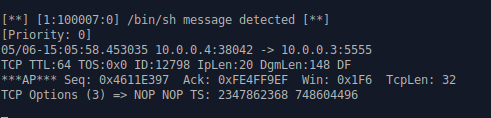
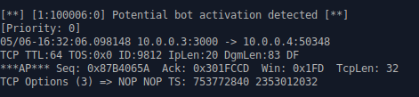
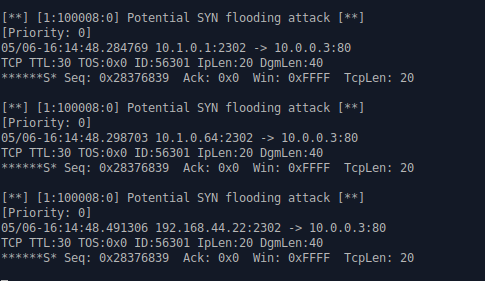

# 7.2 Snort in intrusion detection mode

## 7.2.1 Suspect 1: /bin/sh ?

```shell
# suspect1
./execute suspect1 10.0.0.3
```


- the `/bin/sh` command is used in scripts or other programs as a way to execute system commands or run shell scripts. 

**Add rules to discover attacks**

```shell
alert tcp any any -> $HOME_NET any (flags: PA; content:"/bin/sh"; msg:"/bin/sh message detected"; sid:100007)
```

**check the alert**

​	


## 7.2.2 Suspect 2: Xmas Attack

```shell
# suspect2
./execute suspect2 10.0.0.3
```


In the suspect2 attack, the attacker seems to **inject the XMAS attack.** The XMAS attack has a TCP packet with the URG, PUSH, and FIN flags set. These flags are also used in normal TCP traffic but they are not usually used together in a single packet.

**Add rules to discover attacks**

```SHELL
alert tcp any any -> $HOME_NET any (flags: FPU; msg:"XMAS Attack Detected"; sid:100004;)
```

​	


## 7.2.3 Suspect 3: Execute the command on the Windows system


```shell
# suspect3
./execute suspect3 10.0.0.3
```


In suspect3 attack, the attacker uses the "PUSH ACK" flag in combination with a malicious payload. This payload seems to exploit a vulnerability in a web server or application. This could lead to remote code execution on the target system. The "PUSH ACK" flag set with a combination of the commands such as GET is used to retrieve a file from the target system or execute a command on it. In this case, **we see that the attacker is attempting to execute the "dir" command on the Windows system, which can be used to list the contents of a windows directory.** The attacker here try to attempt downloading or uploading files, modify system settings, or install malware on to the target system. This type of attack can be severe as the attacker could compromise the target system, or have unauthorized access to sensitive data, and disruption of critical services.

​	

**Add rules to discover attacks**

```shell
# Detect possible command execution over HTTP traffic
var HTTP_PORTS 8080,80,443

alert tcp any any -> $HOME_NET $HTTP_PORTS (flags: PA;content:"/c"; content:"/system32"; within:15; msg:"Possible Command Execution"; sid:100005)
```

- `flags: PA`: This specifies that the rule will only match TCP packets with the PSH and ACK flags set. This is because the rule is looking for a specific sequence of bytes that might not appear until a TCP segment is complete and pushed.
- `content:"/c";`: This looks for the presence of the string "/c" in the payload of the TCP segment. This is the command line switch for the Windows Command Prompt to execute a command.
- `content:"/system32";`: This looks for the presence of the string "/system32" in the payload of the TCP segment. This is the default location of many important system files and binaries on a Windows system.
- `within:15`: This specifies that the two content matches must be within 15 bytes of each other. This is to ensure that they are part of the same command being executed.
- `msg:"Possible Command Execution";`: This is the message that will be logged when the rule is triggered.
- `sid:100005`: This is the unique identifier for the rule.

​	


## 7.2.4 Suspect 4: Activation of bots?


```shell
# suspect4
./execute suspect4 10.0.0.3
```


- `0x44556677` seems to be a memory address, memory addresses are often notated as a hexidecimal value prefixed with `0x`
- `activating botz` likely means activating bots, which are automated computer programs that can perform tasks.

**Add rules to discover attacks**

````shell

alert tcp any any -> $HOME_NET $HTTP_PORTS (flags: PA; content:"0x"; content:"activat"; within:30; msg:"Potential bot activation detected";  nocase; sid:100006)
````

​	


## 7.2.5 Suspect 5: SYN Flooding

- The SYN flag is used during the TCP three-way handshake to initiate a connection between two hosts. 

- **The ECN flag is used to indicate network congestion to the endpoints of a TCP connection.** When the ECN flag is set, it indicates that the network is experiencing congestion and the endpoints should slow down the rate at which they are sending data.
- When a SYN packet with the ECN flag set is sent from a client to a server, it means that the client supports ECN and is requesting that the server use it as well. The server may respond with a SYN-ACK packet indicating that it also supports ECN. If both client and server support ECN, they can use it to avoid congestion and improve network performance.
- ECN and CWR are related to bandwidth congestion, but in a SYN or SYN/ACK packet they're just parameters to tell the other receiver of that packet that it's a mechanism understood by the sender. **So sometimes you see a TCP handshake with those two flags, but that doesn't mean there is congestion.**
- ECN is used during the establishment on a TCP connection to signal that the initiating TCP endpoint is willing and capable of handling Explicit Congestion Notification for this connection, see [here](https://www.rfc-editor.org/rfc/rfc3168.html#section-6.1.1). **Depending on the rest of the connection establishment ECN can be used or not.**


```shell
# suspect5
./execute suspect5 10.0.0.3
```


```shell
# There are three ranges of private IP addresses defined in the Internet Protocol version 4 (IPv4) addressing scheme
10.0.0.0 to 10.255.255.255 (10/8 prefix)
172.16.0.0 to 172.31.255.255 (172.16/12 prefix)
192.168.0.0 to 192.168.255.255 (192.168/16 prefix)
```

We have observed from the wireshark logs that in suspect5 attack, the SYN (TCP synchronization) and **ECN** **(Explicit Congestion Notification)** flags are sent together repetitively to the destination from different IP addresses. This type of network attack can lead to a more sophisticated and impactful form of denial-of-service (DoS) attacks. Some potential impact of this attack can be 'amplification attack', and 'resource exhaustion'. From the literature review we found that it may require more sophisticated mitigation techniques as well as higher network capacity to handle the increased traffic and congestion notifications effectively.

**Add rules to discover attacks**

```shell
alert tcp any any -> $HOME_NET any (flags: S; threshold: type limit, track by_src, count 10, seconds 1; msg:"Potential SYN flooding attack"; sid: 100008)
```

- `flags: S`: This specifies that the rule should match only on TCP packets with the SYN flag set (indicating the start of a TCP connection).

- `threshold` keyword in a Snort rule is used to limit the number of alerts generated by a rule. 

- `type limit` to apply the threshold only to the source address.

- `track by_src`: This specifies that the threshold should be based on the number of unique source IP addresses that trigger the rule, rather than the total number of matches.

- `count 10`: This specifies the maximum number of matches within the time window that will trigger an alert. In this case, the threshold is set to 10 matches.

- `seconds 1`: This specifies the time window in which the matches are counted. In this case, the time window is set to 1 seconds.

​	


#### Q3: In this assignment, you have written specific rules to discover attacks. This paradigm is known as signature-based detection. Another paradigm for intrusion detection is called anomaly-based detection. Elaborate on the advantages and disadvantages of each.

**Signature-based detection** is based on predefined signatures or patterns of known malicious activities to identify threats. 
It compares network traffic or system events against a signature database and triggers alerts when a match is found. 
It is effective in detecting known threats but may struggle with new or unknown attacks.

**Anomaly-based detection** however focuses on detecting deviations from normal behavior or baselines. 
Anomaly-based detection establishes a baseline of normal activity and generates alerts (Intrusion Detection System) or takes action (Intrusion Detection and Handling System) when abnormal behavior or suspicious activity is detected. 
It is effective in detecting previously unseen attacks but may generate more false positives and also require more resources.


#### Q4: If you remember only one thing from this lab, what should it be?
Making rules can be cumbersome. In signature-based detection the rules set should be generalized as much as possible to detect alicious activities on the network.
